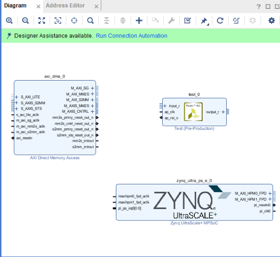
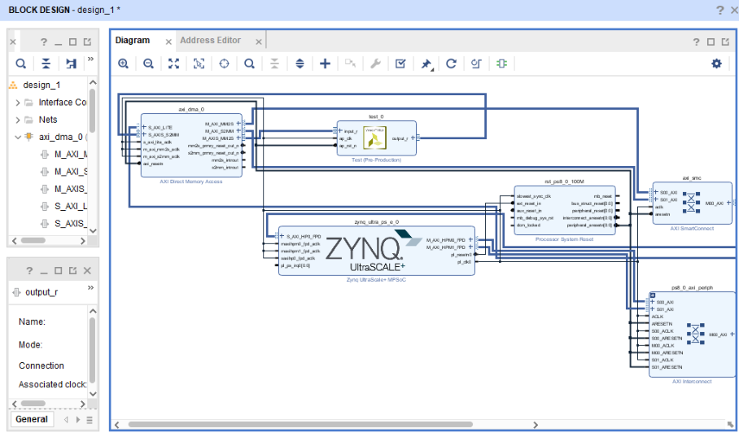
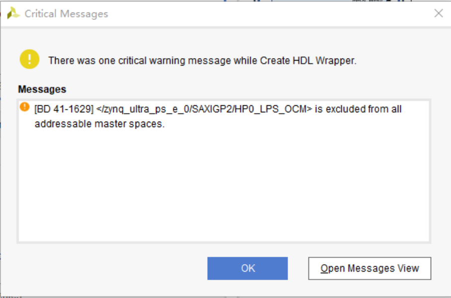
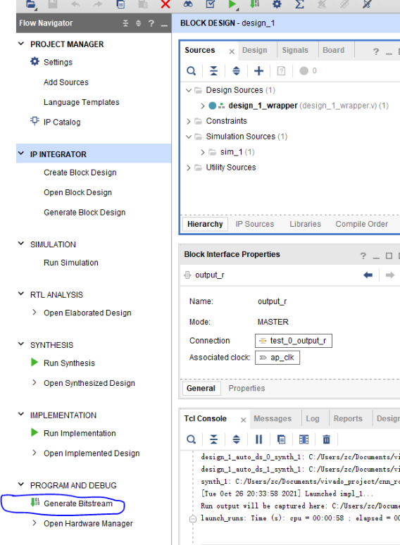

# 实验五：神经网络加速器的硬件实践

## **一、实验目标**

1. 训练 6 种花的分类网络，用 FPGA 加速

2. FPGA 加速对屏幕上 12 种花图像分类

3. 通过 HTTP 将 Artifact 上传到 Central Server，提交 FPGA 计算并读取分类结果。

## **二、考核要求**

【考核 1】能够在 FPGA 上进行 6 分类的 CNN 计算，使用内部存储的图片测试准确率计分。准确率在 50% 以上计满分。(60%)

【考核 2】机器人在屏幕前一定距离，在与屏幕有角度的非理想情况下（保证视野中会有屏幕和 tag），识别屏幕上的花种类，允许移动、转头等任意动作，限时 60 秒。准确率

在 50% 以上计满分。(40%)

【考核 3】可以让机器人与上位机通过 Wifi 进行无线通信，能够正确接收到上位机发来的指令，正确解析到上位机发来的花的种类，并将随意指定的屏幕上的花的种类变为接收到的花的种类, 完成情况可参照“实验一考核 2.mp4”。

## **三、实验指导**

### **3.1 安装和配置环境**

1. 自行安装 Python 环境，需要有 torch、torchvision，推荐用 conda 管理

2. Vivado 软件
  
   (a) 下载链接 https://cloud.tsinghua.edu.cn/d/24f8936484ec4be59108

   (b) Vivado 18.3 安装时，选择 HL design edition，其他选项使用默认值

   (c) Lisence 界面弹出后，选择 Load License，然后点 Copy license，载入vivado_license.lic 文件

   (d) 安装一个补丁包 y2k22_patch-1.2，文件夹里的 README 给出了不同 Vivado 版本安装补丁的方式，照做即可。也可以选择手动安装：把 patch 文件夹里的 automg_xxxxx.tcl 移动到 `<install_location>\Vivado\2018.3\common\scripts` 里即可，不要改变 Vivado 自带的任何文件

### **3.2 网络训练**

1. 运行 cnn_robot.py，运行方式为在 cnn_robot.py 所在路径下执行 python3 cnn_robot.py，第一次运行可能会提示 model_param，dataset 等路径错误，按照错误提示建立相应文件夹，调整相应路径即可。这个文件用于根据已有数据集训练一个结构给定的两层 CNN，可以尝试修改网络结构来达到满意的效果，如果修改网络结构，也需要修改相应的 C++ 文件

2. 运行 write_param.py，将训练好的网络参数写进 network.h 文件，同时将一个测试1样例写入 picture.h，这两个头文件将会在 vivado hls 中使用

### **3.3 生成比特流**

#### **3.3.1**

打开 vivado hls，新建工程，添加以下几个文件，network.h 是网络参数，picture.h是测试用的一张图片，cnn_robot.cpp 用 C++ 实现了 cnn_robot.py 中网络的前向计算，HLS 会根据该段代码生成一个 IP 核，该 IP 核也是整个 FPGA 设计中最主要的部分。

Top Function 为 cnn_robot.cpp 中的 test。之后的 Testbench 添加 tb_cnn_robot.cpp。

Part 按照下图选择，这是 KV260 的 PL 部分。如图1所示。


(a) (b)

注意：先把所有用到的 C++ 文件集中到同一个目录下，然后在 HLS 中加入，如果这些文件不是在同一目录，会出错。

#### **3.3.2**

文件都载入完成后，点击 Run C Simulation，开始执行 tb_cnn_robot.cpp 中的测试，测试完成后，会自动弹出 log 文件，里面有 CNN 的 Linear 层的计算结果，可以和write_param.py 中输出的 Linear 层计算结果对照，确认无误再进行之后步骤。如图2所示。

图 2


#### **3.3.3**

点击 Run C Synthesis，开始综合，这一步会根据 C++ 代码生成 verilog 代码。如图3所示。

图 3


#### **3.3.4**

点击 Export RTL，这一步将已有的工程打包成 IP。如图4所示。

图 4


#### **3.3.5**

打开 vivado，新建工程。

#### **3.3.6**

点击设置，在 IP repository 中添加 vivado hls 工程的路径，以便导入我们自己生成的 CNN 前向计算 IP。如图6所示。

图 6


#### **3.3.7**

点击 Create Block Design。如图7所示。

图 7


#### **3.3.8**

在 Diagram 中点击“+”添加 ZYNQ、dma (AXI direct memory access) 和我们在hls 中生成的 IP，点击 Run block automation，结果类似下图（dma 形状可能和下图不一致，接着往下做就好）。如图8所示。

图 8


#### **3.3.9**

双击 dma，按照下图配置。如图9所示。

图 9


#### **3.3.10**

双击 ZYNQ，按照下图配置。如图10所示。

图 10


#### **3.3.11**

此时结果类似下图。如图11所示。

图 11

#### **3.3.12**

按照下图手动连线。如图12所示。

图 12


#### **3.3.13**

然后点击 Run connection Automation，需要点击多次，直到不能再自动连为止，最后连线结果如下。如图13所示。

图 13


**数据流概述**

- ZYNQ PS（Processing System）：
  
  **–** ZYNQ 的 ARM 处理器（PS 部分，通过 python 编程）负责控制整个系统的运行。

  **–** PS 通过 AXI 总线与 FPGA 逻辑（PL 部分）通信。
  
  **–** PS 负责初始化 DMA 和神经网络 IP 核，并配置数据传输。

- DMA（Direct Memory Access）：
 
  **–** DMA 用于在 PS 的 DDR 内存和 PL 部分的神经网络 IP 核之间高效传输数据。
 
  **–** DMA 可以减轻 PS 的负担，直接搬运数据，而不需要 CPU 参与。

- 神经网络 IP 核：
 
  **–** 神经网络 IP 核是 FPGA 逻辑中实现神经网络前向计算的模块。
 
  **–** 它从 DMA 接收输入数据（本实验为图像），进行计算，并将结果通过 DMA 写回 DDR 内存。
 
**数据流图**

ZYNQ PS (ARM)

|

| (AXI-Lite) 配置和控制

|

DMA (AXI-Stream/AXI-MM)

|

| (AXI-Stream) 输入数据

|

神经网络 IP 核

|

| (AXI-Stream) 输出数据

|

DMA (AXI-Stream/AXI-MM)

|

| (AXI-MM) 写回 DDR

|

ZYNQ PS (ARM) 读取结果

#### **3.3.14**

点击 create HDL wrapper。如图14a所示。

(a) 


(b)


图 14

#### **3.3.15**

忽略 OCM 相关的 critical warning。如图15所示。

图 15


#### **3.3.16**

生成比特流，这一步耗时稍长，可能在 20 分钟左右。如图16所示。

图 16


### **3.4 在线调试**

将两个文件传入 PYNQ，放在同一个目录下，除后缀外统一文件名，就组成了一个overlay：

 - `Vivado_project/project_name/project_name.runs/impl_1/design_1_wrapper.bit`

 - `Vivado_project/project_name/project_name.srcs/sources_1/bd/design_1/hw_handoff/design_1.hwh`


然后参考 demo5_1.ipynb 即可实现在线识别

- `.bit` 是 FPGA Configuration Bitstream，用于配置 KV260 的 PL。
- `.hwh` 是硬件描述元数据。PYNQ 使用它识别硬件 IP、AXI 地址、DMA 和接口信息。

二者必须来自同一次 Vivado 设计生成，并作为一个整体上传。只上传 `.bit`，或混用不同工程/不同版本的 `.bit` 与 `.hwh`，都不是有效 Artifact。

### **3.5 现实识别**

示例数据集的图片是非常理想的，只是为了介绍整个流程，不适用于现实情况，因此同学们需要拍摄现实照片作为数据集，训练神经网络。怎么在现实拍摄的照片中取出屏幕那部分，方法有很多。考虑屏幕是一个黑框这样的特点，可以结合图像处理算法提取图片；也可以思考能否利用屏幕这个物体具有的另外一些信息，不依赖图像处理就能把屏幕标出来。此外，针对现实的光照、角度、运动等非理想情况，系统的鲁棒性也是一个可以提高的方向。

### **3.6 HTTP 与 FPGA 连接**

本次实验中，机器人、FPGA 与上位机服务器之间的部分通讯通过 HTTP 请求完成。实验过程中会使用 Python 的 `requests` 库，下面对 HTTP 协议以及 `requests` 库进行简单介绍。

#### **3.6.1 HTTP 简介**

HTTP（HyperText Transfer Protocol，超文本传输协议）是一种应用层通信协议，主要用于客户端和服务器之间进行数据传输。

在 HTTP 通信过程中，客户端首先向服务器发送请求（Request），服务器接收到请求后进行处理，并向客户端返回响应（Response）。

基本通信过程如下：

```text
客户端
  │
  │ HTTP Request
  ▼
服务器
  │
  │ 处理请求
  ▼
HTTP Response
  │
  ▼
客户端
```

HTTP 中常见的请求方法包括：

1. `GET`：用于从服务器获取数据。

2. `POST`：用于向服务器提交数据。

3. `PUT`：用于更新服务器中的数据。

4. `DELETE`：用于删除服务器中的数据。

在本实验中，主要通过 HTTP 请求完成机器人、FPGA 与服务器之间的数据交互。

#### **3.6.2 requests 库**

`requests` 是一个非常流行的 Python 库，用于发起 HTTP 请求，简化了与 Web 服务和 API 的交互。

它提供了简洁的 API，使开发者能够轻松发送各种 HTTP 请求，如 `GET`、`POST`、`PUT`、`DELETE` 等，并处理服务器返回的响应。

**requests 库的主要特点**

1. **简单易用**：提供人性化的 API 设计，简化处理 HTTP 请求的复杂性。

2. **支持多种请求类型**：支持标准 HTTP 请求方法，如 `GET`、`POST`、`PUT`、`DELETE` 等。

3. **自动处理编码**：能够自动处理 HTTP 响应中的编码和内容。

4. **支持会话管理**：可以通过 `Session` 对象实现会话持久化，例如管理 Cookie。

5. **文件上传和下载**：可以方便地实现文件的上传和下载。

6. **支持 SSL/TLS**：支持 HTTPS，并可以验证服务器证书。

7. **支持代理和超时设置**：能够配置请求中的代理和超时时间。

8. **支持重定向**：能够自动处理服务器返回的重定向响应。

#### **3.6.3 安装 requests 库**

实验开始之前，需要确认 Python 环境中已经安装 `requests` 库。

可以在 Terminal 中输入：

```bash
pip install requests
```

或者：

```bash
pip3 install requests
```

如果已经安装，则无需重复安装。

可以使用下面的 Python 代码检查是否能够正常导入：

```python
import requests

print(requests.__version__)
```

如果能够正常输出版本号，则说明 `requests` 已经安装成功。

#### **3.6.4 GET 请求**

`GET` 请求通常用于从服务器获取数据。

```python
import requests

url = f"http://{IP}/health"
response = requests.get(url)

print(response.status_code)
print(response.text)
```

如果服务器返回的是 JSON 数据，也可以使用：

```python
print(response.json())
```

#### **3.6.5 POST 请求**

`POST` 请求通常用于向服务器提交数据。

在本实验中，可以通过 `requests` 库实现机器人、FPGA 与上位机服务器之间的 HTTP 数据通信。


#### **3.6.6 HTTP 通信流程**

在本实验中，可以将 HTTP 通信过程简单理解为：

```text
机器人 / FPGA
      │
      │ 产生数据或计算结果
      ▼
Python 程序
      │
      │ requests
      │ HTTP Request
      ▼
上位机服务器
      │
      │ 接收并处理数据
      ▼
HTTP Response
      │
      ▼
Python 程序
      │
      ▼
读取服务器返回结果
```

例如，FPGA 完成图像处理或神经网络计算后，可以由 Python 程序读取 FPGA 的输出结果，再通过 HTTP 请求与服务器进行数据交互。

因此，HTTP 在本实验中主要承担不同设备之间的数据通信，而 `requests` 库则提供了在 Python 中发送和接收 HTTP 请求的接口。

### **3.7 通过 HTTP 调用 FPGA**

本实验采用 Central Server 统一管理 FPGA Artifact，并将计算任务调度到 KV260 Worker。整体架构如下：

```text
Student / Client
        │
        │ HTTP
        ▼
Central Server :8000
        │
        │ 保存、版本管理、调度和部署
        ▼
KV260 Worker :8080
        │
        ▼
PYNQ / Overlay / AXI DMA / FPGA
```

学生原则上只需要访问 **Central Server**，不直接选择或硬编码某一台 KV260 Worker。
#### **3.7.1 上传 FPGA Artifact**

FPGA 运行所需的 `.bit` 和 `.hwh` 文件需要先上传至 Central Server。

接口为：

```text
POST /fpga/artifacts
Content-Type: multipart/form-data
```

需要提交：

* `student_id`：学生或队伍标识
* `password`：该 `student_id` 对应的密码
* `bit`：FPGA 比特流文件
* `hwh`：PYNQ 所需硬件描述文件

第一次上传时，由学生自行设置密码。密码长度需要为 **8～128 个字符**。之后再次上传新的 `.bit` 和 `.hwh` 时，需要继续使用相同的 `student_id` 和密码。

上传示例：

```bash
CENTRAL=http://<CENTRAL_SERVER_IP>:8000
read -s STUDENT_PASSWORD

curl -X POST "$CENTRAL/fpga/artifacts" \
  -F student_id=student01 \
  -F password="$STUDENT_PASSWORD" \
  -F bit=@design_1_wrapper.bit \
  -F hwh=@design_1_wrapper.hwh
```

上传成功后，服务器会返回对应的：

```text
artifact_id
```

`artifact_id` 用于标识本次上传的 FPGA Artifact，后续 FPGA 计算会使用该标识。

---

#### **3.7.2 提交 FPGA 计算**

完成 FPGA Artifact 上传后，可以通过 HTTP 向 Central Server 提交图像分类任务。

提交计算时除了 `student_id` 和图片外，还需要使用上传 Artifact 时设置的密码进行身份认证。

例如：

```bash
curl -X POST http://192.168.31.254:8000/predict \
  -H "X-Student-Password: $STUDENT_PASSWORD" \
  -F student_id=student01 \
  -F image=@flower.jpg
```

Windows CMD 中也可以写成一行：

```bash
curl -X POST http://192.168.31.254:8000/predict -H "X-Student-Password: YOUR_PASSWORD" -F student_id=student01 -F image=@flower.jpg
```

其中：

```text
-H "X-Student-Password: YOUR_PASSWORD"
```

用于提交该 `student_id` 对应的认证密码；

```text
-F student_id=student01
```

用于指定当前学生；

```text
-F image=@flower.jpg
```

表示将当前目录下的 `flower.jpg` 上传到 Central Server。

Central Server 收到请求后，会自动完成：

```text
学生上传图片
      ↓
Central Server 接收图片
      ↓
根据 student_id 查找最新 Artifact
      ↓
选择可用的 KV260
      ↓
将 Artifact 部署到 FPGA
      ↓
执行 CNN 推理
      ↓
返回分类结果
```

学生端不需要自行将图片转换成 Base64，也不需要自行构造 FPGA 输入数据。

如果当前存在可用的 KV260，并且计算能够立即完成，服务器通常返回：

```json
{
  "request_id": "req_xxxxx",
  "student_id": "student01",
  "artifact_id": "art_xxxxx",
  "version": "v1",
  "status": "completed",
  "result": {
    "ok": true,
    "status": "success",
    "predicted_class": "taohua",
    "flower": "taohua",
    "flower_api": "taohua",
    "flower_cn": "桃花",
    "raw_class": "桃花",
    "class_index": 8,
    "confidence": 2.95
  },
  "error": null
}
```

如果 `/predict` 返回 HTTP 202，且 `status` 为 `queued`，保存返回的 `request_id`，随后携带相同的 `X-Student-Password` 查询：

```bash
curl -H "X-Student-Password: $STUDENT_PASSWORD" http://192.168.31.254:8000/requests/req_xxxxx
```

继续查询，直到状态变为 `completed` 或 `failed`。

其中主要需要关注：

| 字段            | 含义                    |
| ------------- | --------------------- |
| `request_id`  | 本次计算任务的唯一编号           |
| `student_id`  | 当前学生编号                |
| `artifact_id` | 本次计算使用的 FPGA Artifact |
| `version`     | Artifact 版本           |
| `status`      | 任务状态                  |
| `result`      | FPGA 分类结果             |
| `flower_api`  | 花卉类别的英文标识             |
| `flower_cn`   | 花卉类别的中文名称             |
| `class_index` | CNN 输出类别编号            |
| `confidence`  | CNN 对应类别的输出值          |
| `error`       | 错误信息，正常情况下为 `null`    |

例如：

```json
"flower_api": "taohua",
"flower_cn": "桃花"
```

表示 FPGA 将输入图片识别为**桃花**。

需要注意，`confidence` 为当前 CNN 输出的置信相关数值，具体数值形式由实验中的神经网络实现决定，不一定是 `0~1` 范围内的概率。

如果该 `student_id` 尚未成功上传可用的 Artifact，则 `/predict` 无法进行 FPGA 计算，因此应先完成上一节中的 Artifact 上传。

#### **3.7.3 KV260 内部执行过程**

Central Server 接收到请求后，会选择合适的 KV260 Worker，并将对应的 Artifact 和计算任务发送给该 Worker。

KV260 内部的 FPGA CNN 计算过程可以简单表示为：

```text
.bit + .hwh
    ↓
PYNQ Overlay
    ↓
allocate 输入 / 输出缓冲区
    ↓
AXI DMA sendchannel
    ↓
CNN FPGA IP
    ↓
AXI DMA recvchannel
    ↓
CNN 输出
    ↓
argmax
    ↓
分类结果
```

文件中的：

```text
demo5_2 PYNQ DMA.py
```

可以用于理解单块 KV260 上的 FPGA 分类过程。

参考实现使用：

```text
输入：3 × 28 × 28 float32
输出：12 个 float32
```

FPGA 输出 12 个类别的计算结果后，通过 `argmax` 得到最终分类类别。

因此，完整的数据处理流程为：

```text
学生程序
    ↓
HTTP 请求
    ↓
Central Server
    ↓
选择 KV260 Worker
    ↓
加载对应 Artifact
    ↓
PYNQ Overlay
    ↓
AXI DMA → CNN IP → AXI DMA
    ↓
分类结果
    ↓
Central Server
    ↓
HTTP 返回
    ↓
学生程序
```

通过这种方式，学生只需要通过统一的 HTTP 接口上传 FPGA Artifact 并提交计算任务，而不需要直接管理具体的 KV260 开发板。
