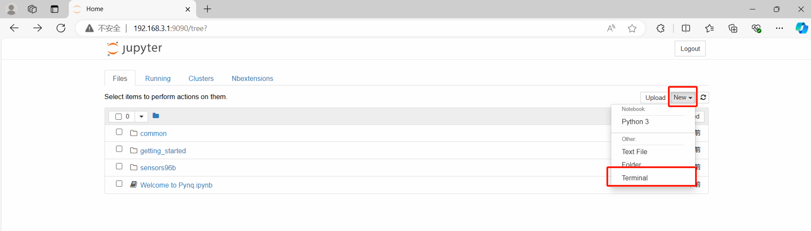
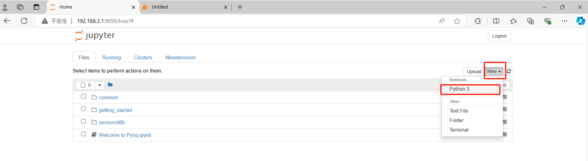
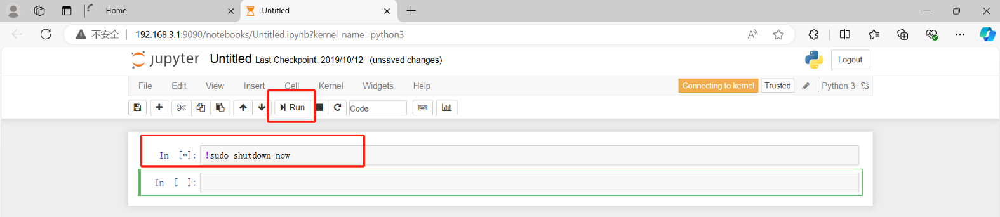
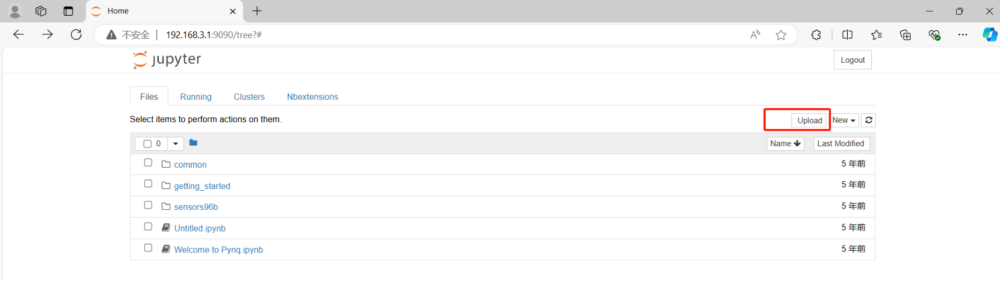
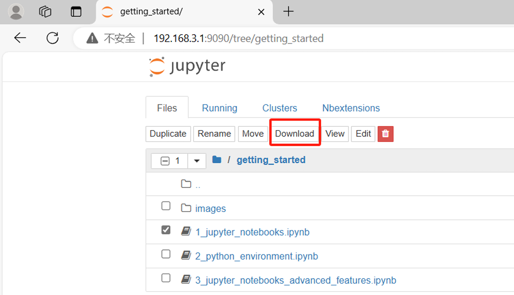

# 实验一：开机、基础操作与控制

## **一、实验目标**

1. 可以正确开关机器人，能够正确上传本地文件到机器人和下载机器人文件到本地。

2. 在 Windows 10/11 下（所有实验）熟悉机器人平台，可以调用动作组使得机器人完成动作，可以调用摄像头使得机器人拍摄照片。

## **二、考核要求**

【考核】要求机器人从指定起点走到指定终点并转身返回起点，机器人行进不能摔倒或偏离场地（到达终点的标准为机器人两脚的中间位置不能偏离指定点 15cm 以上）。在开始整个动作前和完成整个动作后各拍一张照片并储存，之后保存到本地，机器人从指定起点走到指定终点完成情况可参照“实验一考核 1.mp4”。

## 三、实验指导

### 3.1 实验准备

#### 3.1.1 机器人详细信息

本实验使用 Hiwonder TonyPi 机器人，机器人环境如下：

* 机器人型号：Hiwonder TonyPi
* 软件版本：TonyPi 2025
* 主控平台：Raspberry Pi 5 Model B Rev 1.1
* 操作系统：Debian GNU/Linux 12 (Bookworm)
* 系统架构：ARM64

机器人主要程序位于：

```bash
/home/pi/TonyPi
```

主要目录包括：

```text
TonyPi
├── ActionGroups        # 动作组
├── Functions           # 视觉与控制功能
├── HiwonderSDK         # Hiwonder SDK
├── TonyPi.py           # 主程序
├── RPCServer.py        # RPC 服务
└── Camera.py           # 摄像头程序
```

机器人实验相关代码主要位于：

```bash
/home/pi/robotall
/home/pi/robot_tonypi
```

---

#### 3.1.2 PYNQ 环境说明

本实验中的 FPGA 模块使用 KV260，并需要在 KV260 的 Linux 系统中安装和配置 PYNQ 环境。

PYNQ 提供了 Python 控制 FPGA 的相关接口，后续实验程序可以通过 Python 调用 FPGA 中已经加载的硬件设计。

本实验使用的 KV260 已由助教提前完成系统镜像、PYNQ 环境以及相关依赖的安装和配置，因此实验过程中**不需要自行安装 PYNQ 或重新制作系统 SD 卡**。

启动 KV260 后，可以执行：

```bash
uname -a
```

确认系统已经正常启动。

随后可以检查 PYNQ 环境是否正常：

```bash
python3
```

进入 Python 后输入：

```python
import pynq
```

若没有报错，则说明 PYNQ 环境已经正确安装并可以正常使用。

> 注意：正常实验过程中直接使用助教已经配置好的 KV260 环境即可。除非系统损坏或助教另有要求，否则不需要重新烧录 SD 卡或重新安装 PYNQ。

---

#### 3.1.3 如何开机并启动机器人
确认机器人的 IP
通过连接显示屏，在屏幕左上角可以看到机器人的 IP 地址，例如 192.168.31.xxx，或者通过进入终端，输入以下指令：

```bash
hostname -I
```

打开 TonyPi 电源，等待 Raspberry Pi 5 启动。

电脑先 Ping

在 Windows PowerShell：
```
ping 192.168.31.xxx
```

正常应该看到：
```
Reply from 192.168.31.212: bytes=32 ...
```
如果 ping 不通，不要继续跑机器人代码，先解决网络。

通过 SSH 登录机器人：

```bash
ssh pi@机器人IP
```

例如：

```bash
ssh pi@192.168.31.xxx
```
登录需输入密码：raspberrypi(贴纸上含pi字样的机器人密码为pi)

登录后可检查机器人程序：

```bash
ls ~/TonyPi
```

进入程序目录：

```bash
cd ~/TonyPi
```

也可通过游览器登录机器人：

```bash
http://192.168.31.xxx:8888
```

登录需输入密码：pi

---

#### 3.1.4 TonyPi 关机方法（推荐优先级从前往后）

1. 在 Terminal 中输入：

```bash
sudo shutdown now
```


其中 Terminal 可以通过 SSH 登录机器人后直接使用，也可以在机器人本地终端中打开。执行命令后，等待 Raspberry Pi 5 完成系统关机。

2. 如果使用 Jupyter Notebook，也可以在 Notebook 中输入：

```python
!sudo shutdown now
```

（在 notebook 中输入!+shell command 相当于在terminal 中输入 shell command），如图 8 新建 python 文件，然后输入!sudo shutdown now，点击 Run 运行代码





3. 如果无法通过 Terminal 或 Jupyter Notebook 正常关机，可以使用 Raspberry Pi 5 的电源按钮进行关机。

正常情况下，使用前两种方法后，系统会在数秒内开始关机。应等待Raspberry Pi 5 完全关闭后，再关闭 TonyPi 机器人的总电源。

> **注意：** 应尽量优先使用 `sudo shutdown now` 正常关闭系统。直接切断机器人电源可能导致正在写入 SD 卡的数据损坏，严重时可能造成系统文件损坏。

#### 3.1.5 上传文件到机器人

可通过 SCP 上传单个文件：

```bash
scp 文件名 pi@机器人IP:/home/pi/
```

例如：

```bash
scp test.py pi@192.168.31.100:/home/pi/
```

上传文件夹时使用：

```bash
scp -r 文件夹 pi@机器人IP:/home/pi/
```

也可以通过 Jupyter 页面中的 `Upload` 功能上传文件。



---

#### 3.1.6 下载文件到本地

下载单个文件：

```bash
scp pi@机器人IP:/home/pi/文件名 本地路径
```

例如：

```bash
scp pi@192.168.31.100:/home/pi/test.py .
```

下载整个文件夹：

```bash
scp -r pi@机器人IP:/home/pi/TonyPi .
```

也可以通过 Jupyter 页面中的 `Download` 功能下载单个文件。



---

#### 3.1.7 查看机器人状态

查看系统信息：

```bash
hostnamectl
```

查看 Raspberry Pi 型号：

```bash
cat /proc/device-tree/model
```

正常输出：

```text
Raspberry Pi 5 Model B Rev 1.1
```

查看机器人 IP：

```bash
hostname -I
```

查看正在运行的 Python 程序：

```bash
ps aux | grep python
```

---

#### 3.1.8 常用 SSH / SCP 命令

连接机器人：

```bash
ssh pi@机器人IP
```

上传文件：

```bash
scp file.py pi@机器人IP:/home/pi/
```

上传文件夹：

```bash
scp -r folder pi@机器人IP:/home/pi/
```

下载文件：

```bash
scp pi@机器人IP:/home/pi/file.py .
```

下载文件夹：

```bash
scp -r pi@机器人IP:/home/pi/folder .
```

安全关机：

```bash
sudo shutdown now
```

#### 3.1.9 机器人基础指令安装
将提供的 `robotall` 文件夹上传到机器人 `/home/pi/TonyPi/robotall` 目录。登录机器人终端后，依次执行以下两条命令安装机器人基础指令库：

```bash
cd ~/TonyPi/robotall
python3 -m pip install .
```

安装完成后，即可在 Python 程序中导入：

```python
from robotall import act, register_robot, send_request
```

`robotall` 是用于控制 TonyPi 机器人和进行比赛通信的基础库。其中：
- `act` 用于执行机器人预置动作组，例如站立、前进、后退和转向，可用于测试机器人动作是否正常；
- `register_robot` 用于通过 ST25DV04 NFC 标签发送机器人的注册信息；
- `send_request` 用于通过该标签发送比赛任务请求，并读取返回结果。

### **3.2 如何使用机器人进行拍照和做动作**

本节使用已上传到机器人 `/home/pi/test/` 目录的 `demo.ipynb`。该 Notebook 将拍照、转头和行走拆分为独立单元，建议在机器人上的 Jupyter Notebook 中按从上到下的顺序运行。首次使用时，请先确认机器人已启动，并将机器人放在平整地面上。

#### **3.2.1 打开示例并完成初始化**

在 Jupyter 的文件列表中打开 `/home/pi/test/demo.ipynb`。先运行“初始化”单元，再运行“定义拍照与转头函数”单元。初始化会加载动作组、相机和舵机控制库；只有这两个单元均正常运行后，后续测试才能执行。

```python
import hiwonder.ActionGroupControl as AGC
import hiwonder.ros_robot_controller_sdk as rrc
from hiwonder.Controller import Controller

board = rrc.Board()
ctl = Controller(board)
```

#### **3.2.2 测试站立与拍照**

动作测试前先运行站立单元，使机器人保持稳定姿态：

```python
AGC.runActionGroup('stand')
```

随后运行“测试拍照”单元。照片默认保存在机器人 `/home/pi/Pictures/` 目录，终端输出会显示具体文件名。若拍照失败，请检查摄像头连接和机器人系统是否已正常启动。

```python
filename = capture_image()
```

#### **3.2.3 测试转头**

依次运行“向左转头”“向右转头”和“头部回正”单元，观察舵机是否工作正常。示例中每次转动约 30 度；水平舵机脉宽 `1500` 为正前方，数值增大时向左转，数值减小时向右转。

```python
turn_left_30()
turn_right_30()
turn_ahead()
```

#### **3.2.4 测试原地转向与行走**

运行前请保证机器人四周至少有 50 厘米空间；进行向前行走测试时，前方应预留至少 1 米的平整区域。初次测试保持 `times=1`，确认机器人动作稳定后再逐步增加次数。`with_stand=True` 表示动作结束后自动回到站立姿态。

```python
# 原地小步右转一次
AGC.runActionGroup('turn_right', times=1)
AGC.runActionGroup('stand')

# 向前走一步并自动站立
AGC.runActionGroup('go_forward_fast', times=1, with_stand=True)
```

#### **3.2.5 完整演示**

在前面各项均测试正常后，可运行 Notebook 最后的“连续演示”单元。该单元会依次执行站立、拍照、左转头拍照、右转头拍照、头部回正、原地转向和向前行走。请全程留意机器人状态，发现异常时立即停止运行。

#### **3.2.6 AGC 动作组的基本使用**

`AGC` 是 TonyPi 中用于执行预设机器人动作组的接口。使用前需要先导入：

```python
import hiwonder.ActionGroupControl as AGC
```

最基本的调用方式如下：

```python
AGC.runActionGroup('stand')
```

其中，`stand` 表示动作组名称。

也可以在调用时设置简单参数：

```python
AGC.runActionGroup('go_forward_fast', times=1, with_stand=True)
```

- `'go_forward_fast'`：要执行的动作组名称
- `times=1`：动作执行次数
- `with_stand=True`：动作结束后回到站立状态

#### **3.2.7 动作组文件的位置**

TonyPi 的动作通过动作组文件保存，文件扩展名为 `.d6a`，例如：

```text
stand.d6a
go_forward_fast.d6a
turn_right.d6a
```

TonyPi 系统中的预设动作组主要存放在：

```bash
/home/pi/TonyPi/ActionGroups/
```

可使用以下命令查看已有动作组：

```bash
ls /home/pi/TonyPi/ActionGroups
```

只查看 `.d6a` 动作文件时，可使用：

```bash
ls /home/pi/TonyPi/ActionGroups/*.d6a
```

`.d6a` 文件名与调用时使用的动作名称相对应。例如，对于：

```text
stand.d6a
```

在 Python 中通常直接使用动作名称调用(调用时一般不需要写 `.d6a` 后缀。)：

```python
AGC.runActionGroup('stand')
```

如果想自行设计动作，可增加新的动作组 `.d6a` 文件，将其放入 TonyPi 对应的动作组目录后，即可按照动作组名称进行调用。

