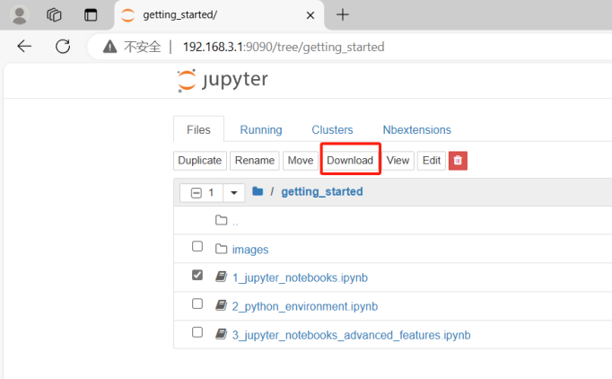
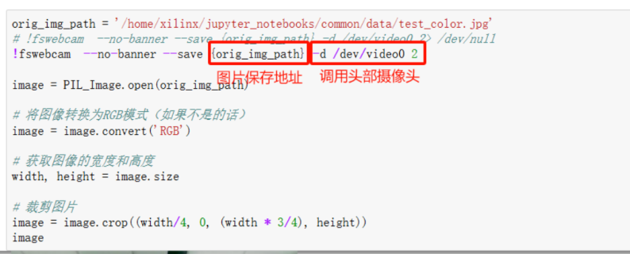
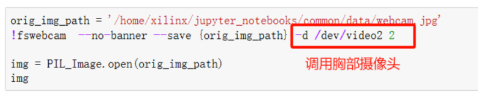
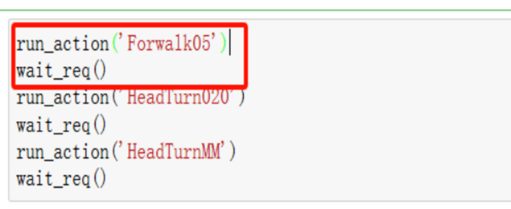
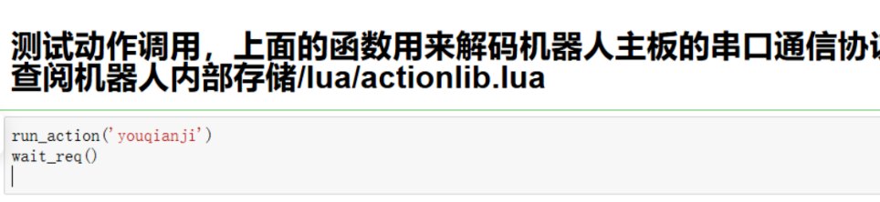
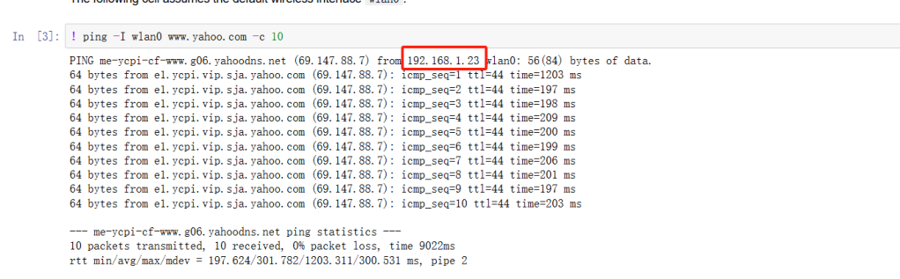
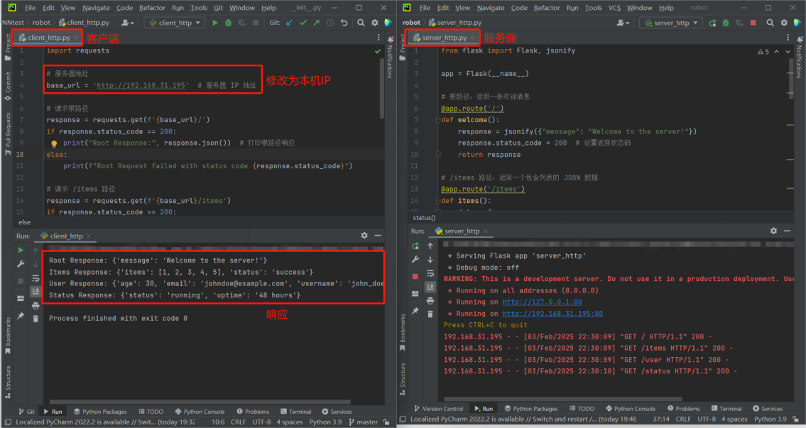

# 实验一：开机、通信

## **一、实验目标**

1. 可以正确开关机器人，能够正确上传本地文件到机器人和下载机器人文件到本地。


2. 在 Windows 10/11 下（所有实验）熟悉机器人平台，可以调用动作组使得机器人完成动作，可以调用摄像头使得机器人拍摄照片。


3. 可以让机器人与上位机通过 Wifi 进行无线通信。

## **二、考核要求**


【考核 1】要求机器人从指定起点走到指定终点并转身返回起点，机器人行进不能摔倒或偏离场地（到达终点的标准为机器人两脚的中间位置不能偏离指定点 15cm 以上）。在开始整个动作前和完成整个动作后各拍一张照片并储存，之后保存到本地，机器人从指定起点走到指定终点完成情况可参照“实验一考核 1.mp4”。


【考核 2】可以让机器人与上位机通过 Wifi 进行无线通信，能够正确接收到上位机发来的指令，正确解析到上位机发来的花的种类，并将随意指定的屏幕上的花的种类变为接收到的花的种类, 完成情况可参照“实验一考核 2.mp4”。

## 三、实验指导

### 3.1 实验准备

#### 3.1.1 机器人内部代码复原

本实验使用 Hiwonder TonyPi 机器人，机器人环境如下：

* 机器人型号：Hiwonder TonyPi
* 软件版本：TonyPi 2025
* 主控平台：Raspberry Pi 5 Model B Rev 1.1
* 操作系统：Debian GNU/Linux 12 (Bookworm)
* 系统架构：ARM64

机器人主要程序位于：

```bash
/home/pi/TonyPi
```

主要目录包括：

```text
TonyPi
├── ActionGroups        # 动作组
├── Functions           # 视觉与控制功能
├── HiwonderSDK         # Hiwonder SDK
├── TonyPi.py           # 主程序
├── RPCServer.py        # RPC 服务
└── Camera.py           # 摄像头程序
```

机器人实验相关代码主要位于：

```bash
/home/pi/robotall
/home/pi/robot_tonypi
```

如需通过 Git 恢复代码：

```bash
cd ~/TonyPi
git status
git pull
```

也可通过 SCP 从电脑上传：

```bash
scp -r 本地文件夹 pi@机器人IP:/home/pi/
```

---

#### 3.1.2 制作包含 PYNQ 的 SD 卡

本实验中的 FPGA 模块使用 KV260，并需要配置 PYNQ 环境。

将准备好的系统镜像烧录至 SD 卡，然后插入 KV260。

启动后可执行：

```bash
uname -a
```

检查 PYNQ：

```bash
python3
```

进入 Python 后输入：

```python
import pynq
```

若没有报错，则说明 PYNQ 环境正常。

---

#### 3.1.3 如何开机并启动机器人

打开 TonyPi 电源，等待 Raspberry Pi 5 启动。

通过 SSH 登录机器人：

```bash
ssh pi@机器人IP
```

例如：

```bash
ssh pi@192.168.31.xxx
```

登录后可检查机器人程序：

```bash
ls ~/TonyPi
```

进入程序目录：

```bash
cd ~/TonyPi
```

需要时可启动 TonyPi 主程序：

```bash
python3 TonyPi.py
```

---

#### 3.1.4 TonyPi 关机方法

推荐通过终端安全关机：

```bash
sudo shutdown now
```

如果使用 Jupyter Notebook，也可执行：

```python
!sudo shutdown now
```

等待系统完全关闭后，再关闭机器人电源。

如果系统无响应，可长按电源键强制关机，但应尽量避免直接断电，以免损坏 SD 卡文件。

---

#### 3.1.5 上传文件到机器人

可通过 SCP 上传单个文件：

```bash
scp 文件名 pi@机器人IP:/home/pi/
```

例如：

```bash
scp test.py pi@192.168.31.100:/home/pi/
```

上传文件夹时使用：

```bash
scp -r 文件夹 pi@机器人IP:/home/pi/
```

也可以通过 Jupyter 页面中的 `Upload` 功能上传文件。

---

#### 3.1.6 下载文件到本地

下载单个文件：

```bash
scp pi@机器人IP:/home/pi/文件名 本地路径
```

例如：

```bash
scp pi@192.168.31.100:/home/pi/test.py .
```

下载整个文件夹：

```bash
scp -r pi@机器人IP:/home/pi/TonyPi .
```

也可以通过 Jupyter 页面中的 `Download` 功能下载单个文件。

---

#### 3.1.7 查看机器人状态

查看系统信息：

```bash
hostnamectl
```

查看 Raspberry Pi 型号：

```bash
cat /proc/device-tree/model
```

正常输出：

```text
Raspberry Pi 5 Model B Rev 1.1
```

查看机器人 IP：

```bash
hostname -I
```

查看正在运行的 Python 程序：

```bash
ps aux | grep python
```

---

#### 3.1.8 常用 SSH / SCP 命令

连接机器人：

```bash
ssh pi@机器人IP
```

上传文件：

```bash
scp file.py pi@机器人IP:/home/pi/
```

上传文件夹：

```bash
scp -r folder pi@机器人IP:/home/pi/
```

下载文件：

```bash
scp pi@机器人IP:/home/pi/file.py .
```

下载文件夹：

```bash
scp -r pi@机器人IP:/home/pi/folder .
```

安全关机：

```bash
sudo shutdown now
```


### **3.2 如何使用机器人进行拍照和做动作**


进入 pynq 后，导入 example_code 中的三个文件，打开 example.ipynb

#### **3.2.1 拍照**


拍照并保存的指令如图 12，图 13：


图 12


5







图 13


拍照保存后可读取照片进行各种处理。具体操作可参考”机器人拍照视频.mp4”。


注意: 这里由于新机器人的原因，源代码中的 video0 2 为调用胸部摄像头，video2


2 为调用头部摄像头。不确定的同学可以分别遮挡一个摄像头，运行代码，来确定调用


的是哪个摄像头。

#### **3.2.2 做动作**


在做动作之前注意正确调用该文件（主要是注意该文件的地址）, 如图 14：


图 14


函数“run_action”，“crc_calculate”，“cmd2data”，“wait_req”顺序写入后可


开始进行动作编排，如下是一个向前走五步，然后转头 20°，然后再将头回正的动作设


计，切记要在每个 run_action 函数后加上函数 wait_req(), 如图 15，其中的动作名称如


“Forwalk05”可查找“执行函数名称.txt”或者机器人内部存储/lua/actionlib.lua 。


图 15


**附：设计动作** 。


因为不同的机器人会有一些微小的不同，相同的动作在不同的机器人上表现不同，


亦或者原有动作不满足需求，就需要设计一些新动作，设计方法可参考视频“设计动


6



作.mp4”以及文档“新增动作教程”文件夹中的文档, 在设计完成后直接在 jupyter note

book 中调用即可，例如在“设计动作.mp4”中设计的“youqianji”可直接如下调用, 如


图 16：


图 16

### **3.3 如何与上位机进行通信**

#### **3.3.1 连接 WiFi**


请参考 common/wifi.ipynb 进行联网。请用电脑连接 ROBOT_PC，机器人连接


ROBOT_ROBOT。请不要让电脑抢占 ROBOT_ROBOT 的资源。密码均为 robotclass。


若连接成功，ping 完之后可看到机器人的 ip 如图 17：


图 17


在浏览器输入该 ip 地址，密码同样也是 xilinx，这样就实现了机器人连接 wifi 和


pc 通过 WiFi 连接机器人，可以进行无线的编程和调试，之后的注册和改变花色都必须


通过 WiFi 通信实现。


也可以在 terminal 输入 ifconfig 进行查看。


具体操作可参考”机器人连接 wifi_pc 通过 wifi 连接机器人.mp4”。


**Wi-Fi** **协议的主要特点**


1. 标准化协议：Wi-Fi 基于 IEEE 802.11 系列标准，提供了设备之间无线通信的规范。


这些标准规定了不同频段、调制技术、数据速率等参数。


7





2. 无线传输：使用无线电波在 2.4 GHz 和 5 GHz 频段（以及更新标准中的 6 GHz 频


段）传输数据，避免了有线连接的限制。


3. 多设备连接：支持多个设备同时连接，通过路由器或接入点（AP）实现局域网内设


备的互联互通，并可连接互联网。


**Wi-Fi** **协议中的关键技术**


1. 调制技术：使用 OFDM（正交频分复用）或 DSSS（直接序列扩频）等技术来调制


信号，提高频谱效率和抗干扰能力。


2. MIMO 技术：通过多个天线同时发送和接收数据，提升数据传输速率和信号稳定


性。


3. CSMA/CA（载波侦听多路访问/碰撞避免）：避免数据传输冲突，保证无线信道的


公平使用。


4. 加密与认证：使用 WPA3 等加密技术保护无线网络的安全，防止未授权设备访问。


感兴趣的同学想了解更多科研，请查看如下链接：


[https://www.wi-fi.org/](https://www.wi-fi.org/)

#### **3.3.2 注册机器人**


在上位机允许机器人注册的时候（由助教控制），每个同学可以进行注册，注册指


令格式为：


192.168.1.254/api/initTeam/:name/:secret (将:name,:secret 分别替换为自己队伍的


机器人名和密码 (命名时记得省略:)）


注册成功后上位机会返回一个字典，里面有你注册的 name，secret 以及一个花的


种类等信息。

#### **3.3.3 改变花的种类**


在上位机允许机器人改变花种类的时候（由助教控制）改变花种类，命令格式为：


192.168.1.254/api/change/:name/:secret/at/:screenid/from/:fromflower/to/:toflower


(指令中的五个变量分别是，机器人名，密码，屏幕 id，目前该屏幕上花的种类，要变成


的花的种类,将:name,:secret 分别替换成前述所设置的队伍名称和密码，:screenid 为场地


中的屏幕编号，:fromflower 为所选屏幕中的花的种类，:toflower 可以从下面选择一种花


进行替换)


其中 flower 可以是：bailianhua chuju hehua juhua lamei lanhua meiguihua shuixi

anhua taohua yinghua yuanweihua zijinghua


8


**HTTP**


本次实验中一切通讯都是通过 HTTP 请求完成的，实验过程中会用到 requests 库，


下面对该库进行简单介绍：


requests 是一个非常流行的 Python 库，用于发起 HTTP 请求，简化了与 Web 服


务和 API 的交互。它提供了简洁的 API，使开发者能够轻松地发送各种 HTTP 请求，


如 GET、POST、PUT、DELETE 等，并处理服务器响应。


**主要特点**


1. 简单易用：提供人性化的 API 设计，简化了处理 HTTP 请求的复杂性。


2. 支持多种请求类型：支持标准的 HTTP 请求方法（如 GET、POST、PUT、DELETE


等）。


3. 自动处理编码：自动处理 HTTP 响应中的编码和内容，返回适合的数据类型。


4. 支持会话管理：通过 Session 对象可以实现会话的持久化（比如管理 cookie）。


5. 文件上传和下载：简化文件的上传和下载过程。


6. 支持 SSL/TLS：提供安全的 HTTPS 支持，并可以验证服务器证书。


7. 支持代理和超时设置：能够轻松配置请求中的代理和超时时间。


8. 支持重定向：自动处理服务器的重定向响应。


实验开始之前，首先给机器人链接上网络，安装 requests 库.


`#` 在 `jupyter` `notebook` 环境下，你可以运行以下 `Python` 代码：

```
import sys

!{sys.executable} -m pip install requests

```

也可以直接在 bash 下


`pip` `install` `requests` `#` 或者 `pip3` `install` `requests`


requests 库的示例使用


`#` `GET` 请求是最常用的 `HTTP` 请求类型，通常用于从服务器获取数据。

```
import requests

url = f"http://{IP}/api/initTeam/{name}/{secret}"

response = requests.get(url)
```

`print` `(response.status_code)` `#` 获取响应状态码


9


`print` `(response.text)` `#` 获取响应内容

`print` `(response.json())` `#` 如果响应内容是 `JSON` 格式，可以将

其解析为 `Python` 字典或列表。


10


为了帮助大家理解 http，为大家提供了 http 协议的客户端和服务端供大家学习理


解，大家在本地同时运行两个程序，请求成功后可以在客户端可以看到对应的响应，对


代码的介绍见图 18，代码已上传至网络学堂。


图 18


11





### **3.5 scp 命令**

机器人和电脑之间传输文件可以使用 scp 命令：

1. 查找机器人 ip 地址，bash 下使用命令，终端中就会给出当前网络中机器人的 IPV4

地址

```
     hostname -I

```

2. 文件从机器人到电脑

```
     scp remote_username@remote_ip:remote_file_path

      local_file_path

```

文件夹从机器人到电脑

```
     scp -r remote_username@remote_ip:remote_folder_path

      local_folder_path

```

3. 文件从电脑到机器人

```
     scp local_file_path remote_username@remote_ip:

      remote_file_path

```

文件夹从电脑到机器人

```
     scp -r local_folder_path remote_username@remote_ip:

      remote_folder_path

```

PS：如果你有在机器人上限制访问端口，可在-r 后加上-P port 来通过指定端口进行文件传输。也可以不使用 scp，直接在 jupyter notebook 上逐个下载文件。

