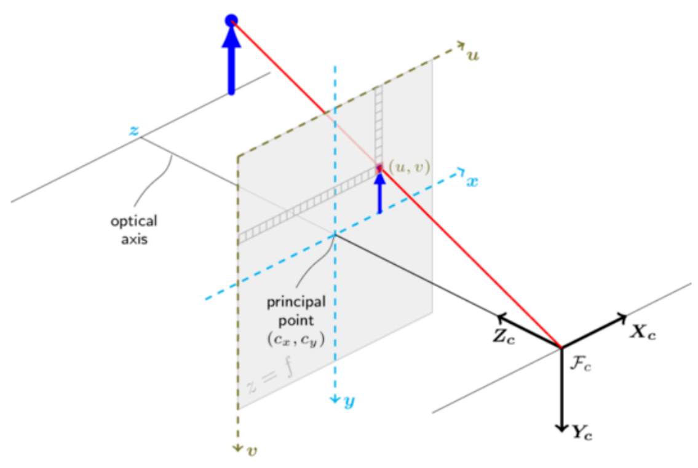
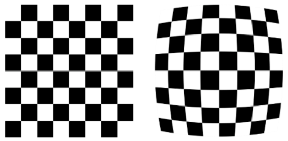
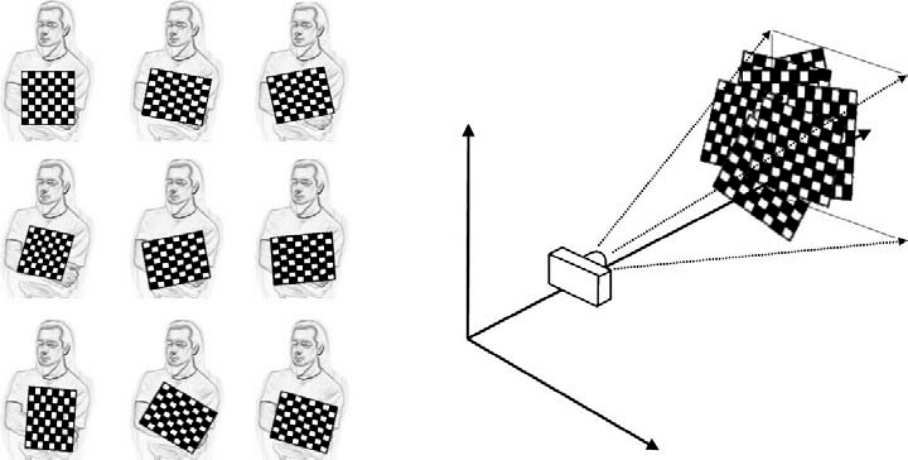
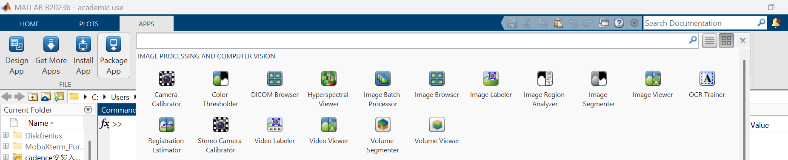
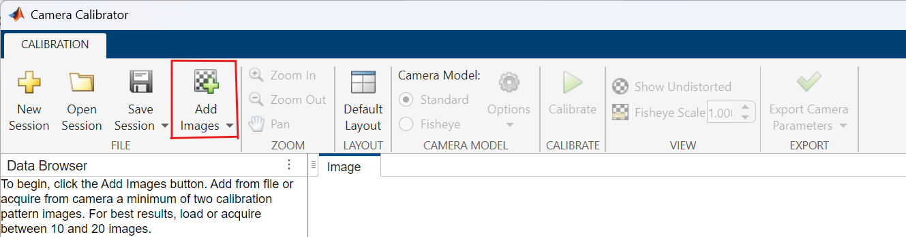
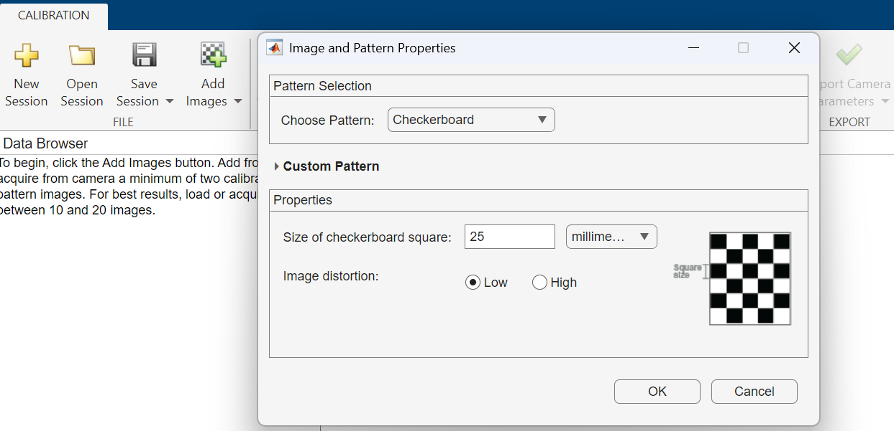
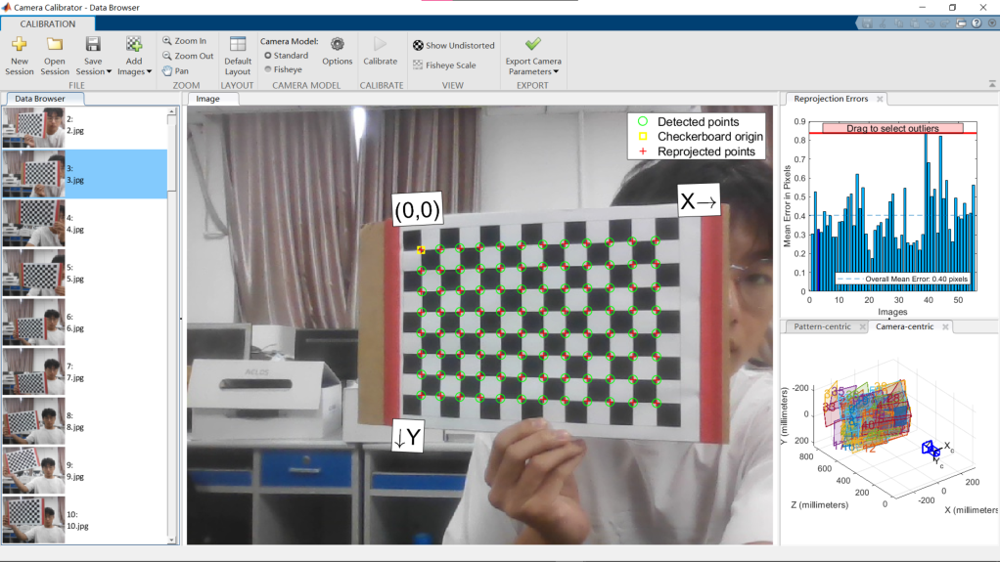
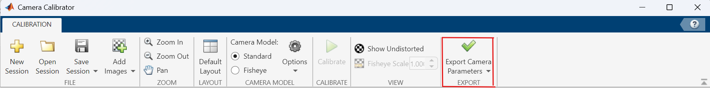
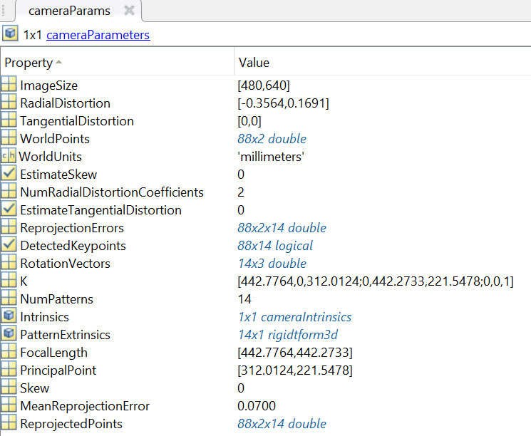

# 实验三：定位

## **一、实验目标**

1. 了解像素坐标，机器人坐标，世界坐标之间的坐标变换

2. 了解摄像头参数和标定参数的方法

3. 了解如何使用 AprilTag 定位

## **二、考核要求**

【考核 1】定位

【实验说明】在比赛场地上进行验收。验收时，助教将机器人随机放置在比赛场地中一个点位上，并确保机器人视野中存在可供识别的 AprilTag。机器人需要通过 Tag 确定自身位置，向控制终端返回自身坐标，并判断自己所处的点位序号。验收示范可参考网络学堂“实验三验收视频.mp4”。

【验收要求】返回坐标与参考坐标之间的绝对误差不超过 15cm

【考核 2】机器人身体朝向判断

【实验说明】为了让机器人沿规划好的路线前进，我们不仅需要确定机器人的位置，还需要知道机器人身体的朝向。本次实验在比赛场地上进行验收。验收时，助教将机器人放在场地上的随机位置，并确保机器人视野中存在可供识别的 AprilTag。机器人需要通过Tag 确定摄像头的朝向，并向控制终端返回自己的朝向。验收示范可参考网络学堂“实验三验收视频.mp4”。

【验收要求】机器人只需要正确判断自身朝向靠近 x 轴正负/y 轴正负方向中的哪一个即可

## **三、实验指导**

### **3.1 坐标变换**

#### **3.1.1 四个坐标系**

从物理世界到照片的过程会经过下面四个坐标系，如图1所示：

- 世界坐标：空间直角坐标，与地表相对静止，记作$r_w = \begin{bmatrix} x_w & y_w & z_w \end{bmatrix}^{T}$

- 相机坐标：空间直角坐标，原点位于透视点， _z_ 轴与相机光轴重合，正方向与光线方向相反。相机坐标与相机相对静止，记作$r_c = \begin{bmatrix} x_c & y_c & z_c \end{bmatrix}^{T}$

- 图像坐标：投影面上的直角坐标，原点位于光轴与投影面的交点，坐标轴与相机坐标平行，记作$r = \begin{bmatrix} x & y \end{bmatrix}^{T}$

- 像素坐标：数字图像的坐标，左上角为原点， _u_ 轴向右， _v_ 轴向下，记作$p = \begin{bmatrix} u & v \end{bmatrix}^{T}$

图 1: 四个坐标系示意图


#### **3.1.2 坐标系的变换关系**

- **世界坐标到相机坐标**
  
  世界坐标与相机坐标之间是平移 + 旋转关系：
  
  $r_c = Rr_w + t$
  
  将其写为分块矩阵乘法形式：
  
  $\left[\begin{matrix}r_c\\1\\\end{matrix}\right]=\left[\begin{matrix}R&t\\0&1\\\end{matrix}\right]\left[\begin{matrix}r_w\\1\\\end{matrix}\right]$

- **相机坐标到图像坐标**
  
  相机坐标与图像坐标之间是点透视关系，根据简单的几何学，由位似关系可知：
  
  $\frac{x}{x_c}=\frac{y}{y_c}=\frac{f}{z_c}$

  其中 _f_ 是透视点到投影面的距离，也可以理解为透镜组的等效焦距。将其写为矩阵乘法形式：

  $\left[\begin{matrix}x\\y\\1\\\end{matrix}\right]=\frac{1}{z_c}\left[\begin{matrix}f&0&0&0\\0&f&0&0\\0&0&1&0\\\end{matrix}\right]\left[\begin{matrix}x_c\\y_c\\z_c\\1\\\end{matrix}\right]$


- **图像坐标到像素坐标**
  
  通常约定图像坐标和像素坐标是平移 + 量化关系，如果忽略量化带来的离散性，那么可以将量化视作伸缩：
  
  $u=\frac{x}{d_x}+u_0$
  
  $v=\frac{y}{d_y}+v_0$

  其中$d_x,\ d_y$代表一个像素的大小。将其写为矩阵乘法形式：
  
  $\left[\begin{matrix}u\\v\\1\\\end{matrix}\right]=\left[\begin{matrix}\frac{1}{d_x}&0&u_0\\0&\frac{1}{d_y}&v_0\\0&0&1\\\end{matrix}\right]\left[\begin{matrix}x\\y\\1\\\end{matrix}\right]$


- **世界坐标到像素坐标**
  
  综合上面的结果可以得到：
  
  $\left[\begin{matrix}p\\1\\\end{matrix}\right]=\frac{1}{z_c}\left[\begin{matrix}C&0\\\end{matrix}\right]\left[\begin{matrix}R&t\\0&1\\\end{matrix}\right]\left[\begin{matrix}r_w\\1\\\end{matrix}\right]$
  
  其中$C=\left[\begin{matrix}f_x&0&u_0\\0&f_y&v_0\\0&0&1\\\end{matrix}\right],\quad f_x=\frac{f}{d_x},\quad f_y=\frac{f}{d_y}$为相机的内部参数，$R$和$t$相机的外部参数。


- **畸变现象**

  众所周知，理想透镜成像理论只对傍轴光线近似成立，对于大角度的光线，透镜通常会产生畸变，如图2所示。因此需要对图像坐标进行修正：

  $x'=x(1+k_1r^2+k_2r^4)+p_1(r^2+2x^2)+2p_2xy$

  $y'=y(1+k_1r^2+k_2r^4)+p_2(r^2+2y^2)+2p_1xy$
  
  记$D=\left[\begin{matrix}k_1&k_2&p_1&p_2\\\end{matrix}\right]$，称为相机的畸变系数。
  
  图 2: 畸变示意图
  
  

### **3.2 参数求解**

如果已知若干组像素坐标和世界坐标的对应关系，那么可以解出相机的外部参数、内部参数和畸变矩阵。相机的外部参数会随相机的位置改变，相机的内部参数和畸变系数是固定不变的。

#### **3.2.1 相机标定——求解内部参数和畸变矩阵**

利用标定板和 MATLAB 的 Camera Calibrator，可参考视频“实验三相机标定.mp4”。

**拍摄照片**

首先需要打印一张标定板图像。推荐一个生成相机标定板文件（pdf）的网站：

`https://calib.io/pages/camera-calibration-pattern-generator ` 
 
调用机器人的摄像头，通过调整标定板或摄像机的方向，为标定物拍摄一组不同方向的照片，获取至少 10 张照片并保存，如图3所示，然后导出到本地电脑中。



**MATLAB** **标定**

打开 Matlab，在 Matlab 中找到 APP，点击进入，找到 Camera Calibrator 工具箱（没有就下载），如图4所示。


进入工具箱，点击 Add Images，如图5所示。


将所有图片添加进去（这里的 25 是指棋盘中正方形的边长大小，可以根据自己生成的棋盘方格边长调整），如图6所示。


然后点击 Calibrate 按钮，即完成标定，如图7所示。


**导出参数**

点击 Export Camera Parameters，如图8所示。

可在 matlab 工作空间里可以看到相机参数的属性，如图9所示。其中的 [IntrinsicMatrix]是相机的内部参数，[RadialDistortion TangentialDistortion]组成相机的畸变系数。





#### **3.2.2 Perspective-n-Point(PnP) 问题——求解外部参数**

可以利用 opencv 的 solvePnP 和 Rodrigues 函数来求解 PnP 问题，下面给出函数的简要说明，更加详细的内容可以参考 opencv 的官方文档。

**solvePnP**

```
cv.solvePnP(objectPoints, imagePoints, cameraMatrix, distCoeffs [, rvec[, tvec[, useExtrinsicGuess[, flags]]]]) -> retval, rvec, tvec
```

输入：

 - objectPoints：形状为 _N_ _×_ 3 的 numpy 数组，表示 N 个点的世界坐标

 - imagePoints：形状为 _N_ _×_ 2 的 numpy 数组，表示 N 个点的像素坐标

 - cameraMatrix：形状为 3 _×_ 3 的 numpy 数组，表示相机的内部参数

 - distCoeffs：长度为 4 的 numpy 数组，表示相机的畸变系数

输出：

 - retval：是否计算成功

 - tvec：平移向量，即公式7中的 _t_

 - rvec：旋转向量，需要通过 Rodrigues 函数转换为公式7中的 _R_

备注：

 - objectPoints 和 imagePoint 形状的 _N_ 必须相同，并且 _N_ _≥_ 4

 - 本实验中 objectPoints 和 imagePoints 选取了场地上 AprilTag 的各个角点，object Points 可以由自定义函数 load_tag_pos 获得，详见第3.4节，imagePoints 可以由图像识别结果得到，详见实验二。

**Rodrigues**

```
cv.Rodrigues(src[, dst[, jacobian]]) -> dst, jacobian
```

输入：

 - src：长度为 3 的 numpy 数组，表示旋转向量，即 solvePnP 的输出 rvec

输出：

 - dst：形状为 3 _×_ 3 的 numpy 数组，表示旋转矩阵，即公式7中的 _R_

### **3.3 方位估计**

相机的方位与外部参数之间存在一一对应关系，如果已知外部参数，那么可以得到相机的方位。具体来说，相机坐标系的原点即是相机的位置，它的世界坐标为$-R^{-1}t$，相机坐标系的 z 轴单位向量即是相机的方向，它的世界坐标为$R^{-1}\left[\begin{matrix}0&0&1\\\end{matrix}\right]^{T}$。

### **3.4 场地上 AprilTag 的世界坐标**

为了利用 AprilTag 对机器人进行定位，我们不仅需要知道 AprilTag 在图像中的位置，还需要提前知道每个 AprilTag 在实际比赛场地中的位置。

本实验在 load_pos.py 文件中定义了 load_tag_pos() 函数。该函数保存了场地中所有 AprilTag 的世界坐标，并以字典的形式返回。

场地中的 AprilTag 分为两类：

- 1～36 号 Tag：安装在 9 个方形障碍物的四个侧面上，每个障碍物有 4 个 Tag。
- 37～61 号 Tag：安装在场地地面上。

每个 AprilTag 使用一个 4 × 3 的 NumPy 数组表示四个角点的三维世界坐标，四个角点依次对应 AprilTag 的左上、右上、右下、左下，并与 apriltag.Detector.detect() 返回的角点顺序保持一致。

这些世界坐标将作为 solvePnP() 的 objectPoints，与图像中检测到的 Tag 像素坐标对应，从而计算机器人的位置和朝向。

