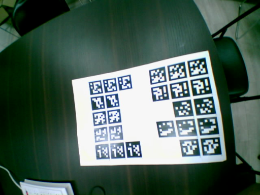
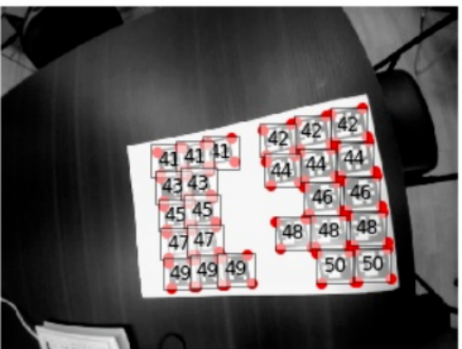

# 实验二：AprilTag 识别

## **一实验目标**

1. 了解 Apriltag 的概念以及应用场景，了解 Apriltag 检测算法的原理，能够在图像中检测到 Apriltag，并能利用反馈到的信息进行一些简单任务。

2. 能够在行进过程中发现带有Apriltag的其他机器人。

## **二考核要求**

【考核 1：静态 Apritag 识别】用机器人拍摄课程准备的照片，并能检测到图中所有的Apriltag 图标，可以将每个 Apriltag 图标的四个角标注出来，并在 Apriltag 图标中间标明该 Apriltag 的 ID，最终效果如图 1，图 2.

【考核 2：动态 Apritag 识别】你的机器人站在固定位置，面前会有测试机器人经过，如果有机器人经过并且你检测到了机器人，请让你的机器人转头，否则不要转头。测试共三次，每次助教都会调整测试机器人的位置。（被测试机器人位置随机，角度随机，走过的方式时长随机）

考核最终可参考视频“实验二考核二.mp4”。





## **三实验指导**

在这里简要介绍一下 Apiltag 检测的原理，分为如下几步：

### **3.1 线段检测**

对图像进行灰度处理，通过梯度差和幅度差来确定是否在两个像素点之间添加边缘，由此构成图像中的线。

### **3.2 四边形检测**

在一条线的基础上，遍历其他线条，通过首尾相近等原则找出图中所有可能的四边形。

### **3.3 图形单应性变换**

这个算法步骤主要是为了恢复图形大小，并矫正失真（还可以计算 Apriltag 距离相机的位置该功能在检测中暂时用不到），该算法利用 Apriltag 的物理大小和相机的焦距计算单应矩阵，通过单应矩阵将图像中的 Apriltag 恢复到正常大小并矫正由于拍摄角度和透视效果等原因带来的失真。

### **3.4 解码**

得到图像中的“四边形”后要和 Apriltag 进行比对，判断“四边形”是否有效，以及对应的 Apiltag ID 是多少。可以通过计算“四边形”和 Apriltag 四个角度旋转的“汉明距离”来进行判断。

算法的论文链接如下，同学们可以查看：
https://ieeexplore.ieee.org/document/7759617

### **3.5 AprilTag 库简介**

这些算法的实现在 python 中有一些现成的库, 比如 Apriltag, opencv等，下面简单对此进行一个介绍。实验开始之前，首先给机器人链接上网络，然后安装 apriltag 库 (其中 OpenCV 的库已经用 apt 装好了，可以用 apt list 查看)。

`#` 在 `jupyter` `notebook` 环境下

```
import sys

!{sys.executable} -m pip install apriltag

```

`#` 在 `bash` 下

`pip3` `install` `apriltag` `#` 或者 `pip3` `install` `apriltag`

**注:**

AprilTag 有多个种类（family），每个 family 包含一组图案，其中每一个图案在family 中拥有其唯一的 ID。本实验中使用的 family 的名称为 tag36h11，在识别时必须在程序中加入该信息。

AprilTag 库在识别到图片中有对应 family 的 Apriltag 后会返回每一个 tag 的如下信息：

1. Apriltag 的四个角在图片中的位置（pixel，像素）

2. Apriltag 的 ID（每一个 tag）

3. Apriltag 的 homography matrix

为了帮助大家更好地理解和掌握，相关的链接如下，大家可以参考：

[https://pyimagesearch.com/2020/11/02/apriltag-with-python/](https://pyimagesearch.com/2020/11/02/apriltag-with-python/)

Apriltag 的一些介绍大家可以参考如下链接：

[https://april.eecs.umich.edu/software/apriltag](https://april.eecs.umich.edu/software/apriltag)
