# 实验五：神经网络加速器的硬件实践

## **一实验目标**

1. 训练 6 种花的分类网络，用 FPGA 加速

2. FPGA 加速对屏幕上 12 种花图像分类

## **二考核要求**

【考核 1】能够在 FPGA 上进行 6 分类的 CNN 计算，使用内部存储的图片测试准确率计分。准确率在 50% 以上计满分。(60%)


【考核 2】机器人在屏幕前一定距离，在与屏幕有角度的非理想情况下（保证视野中会有屏幕和 tag），识别屏幕上的花种类，允许移动、转头等任意动作，限时 60 秒。准确率

在 50% 以上计满分。(40%)

## **三实验指导**

### **3.1 安装和配置环境**

1. 自行安装 Python 环境，需要有 torch、torchvision，推荐用 conda 管理

2. Vivado 软件

(a) 下载链接 [https://cloud.tsinghua.edu.cn/d/24f8936484ec4be59108/](https://cloud.tsinghua.edu.cn/d/24f8936484ec4be59108/)

(b) Vivado 18.3 安装时，选择 HL design edition，其他选项使用默认值

(c) Lisence 界面弹出后，选择 Load License，然后点 Copy license，载入 vivado_license.lic 文件

(d) 安装一个补丁包 y2k22_patch-1.2，文件夹里的 README 给出了不同 Vivado 版本安装补丁的方式，照做即可。也可以选择手动安装：把 patch 文件夹里的 automg_xxxxx.tcl 移动到 `<install_location>\Vivado\2018.3\common\scripts` 里即可，不要改变 Vivado 自带的任何文件


(e) 将 ultra96v2 目录放进以下路径： `<install_location>\Vivado\2018.3\data\boards\board_files` (关于这一步，有兴趣可以阅读这个网址了解详情(https://github.com/Avnet/bdf))

### **3.2 网络训练**

1. 运行 cnn_robot.py，运行方式为在 cnn_robot.py 所在路径下执行 python_cnn_robot.py，第一次运行可能会提示 model_param，dataset 等路径错误，按照错误提示建立相应文件夹，调整相应路径即可。这个文件用于根据已有数据集训练一个结构给定的两层 CNN，可以尝试修改网络结构来达到满意的效果，如果修改网络结构，也需要修改相应的 C++ 文件

2. 运行 write_param.py，将训练好的网络参数写进 network.h 文件，同时将一个测试

样例写入 picture.h，这两个头文件将会在 vivado hls 中使用

### **3.3 生成比特流**

#### **3.3.1**


打开 vivado hls，新建工程，添加以下几个文件，network.h 是网络参数，picture.h是测试用的一张图片，cnn_robot.cpp 用 C++ 实现了 cnn_robot.py 中网络的前向计算，HLS 会根据该段代码生成一个 IP 核，该 IP 核也是整个 FPGA 设计中最主要的部分。


Top Function 为 cnn_robot.cpp 中的 test。之后的 Testbench 添加 tb_cnn_robot.cpp。

Part 按照下图选择，这是 U96 的 PL 部分。如图1所示。


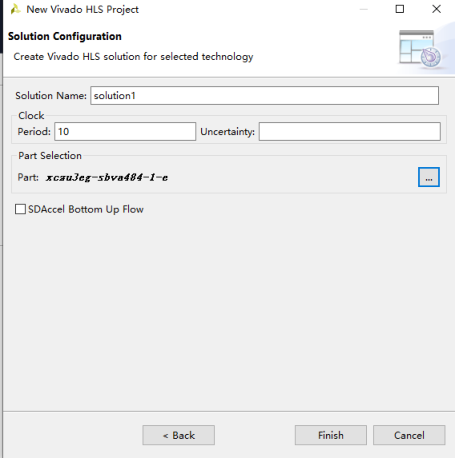
(a) (b)

注意：先把所有用到的 C++ 文件集中到同一个目录下，然后在 HLS 中加入，如果这些文件不是在同一目录，会出错。

#### **3.3.2**


文件都载入完成后，点击 Run C Simulation，开始执行 tb_cnn_robot.cpp 中的测


试，测试完成后，会自动弹出 log 文件，里面有 CNN 的 Linear 层的计算结果，可以和


write_param.py 中输出的 Linear 层计算结果对照，确认无误再进行之后步骤。如图2所


示。


图 2

#### **3.3.3**


点击 Run C Synthesis，开始综合，这一步会根据 C++ 代码生成 verilog 代码。如


图3所示。


33


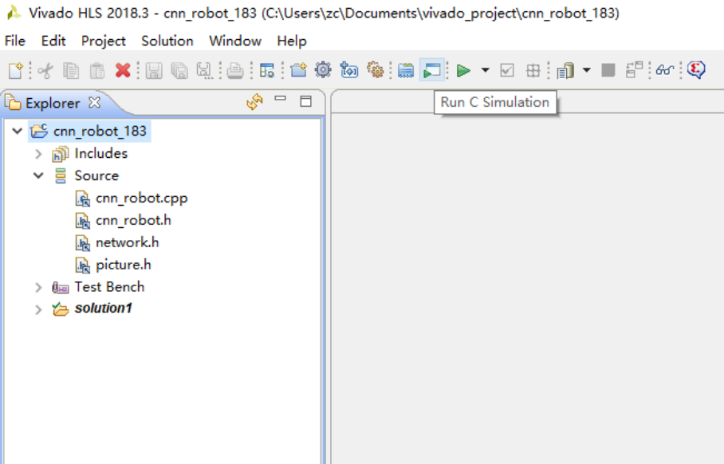
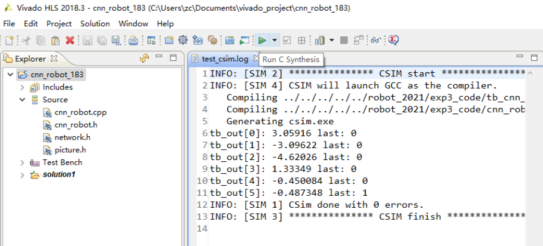

图 3

#### **3.3.4**


点击 Export RTL，这一步将已有的工程打包成 IP。如图4所示。


图 4

#### **3.3.5**


打开 vivado，新建工程，board 选择下图这个。如图5所示。


34


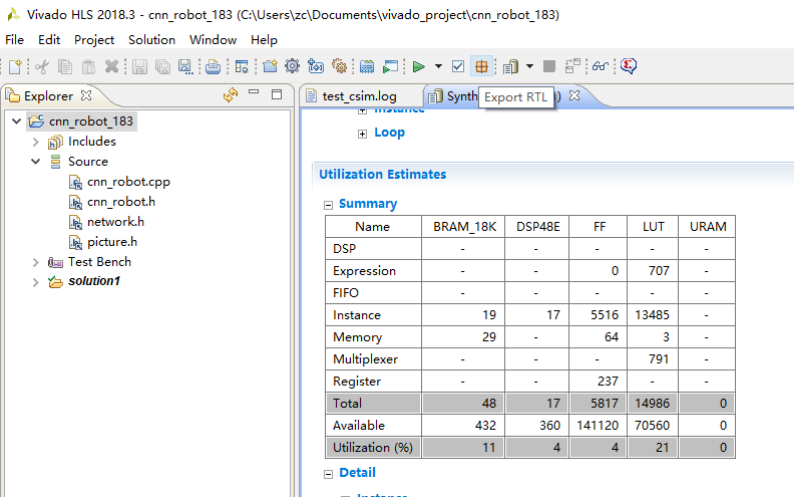


图 5

#### **3.3.6**


点击设置，在 IP repository 中添加 vivado hls 工程的路径，以便导入我们自己生成


的 CNN 前向计算 IP。如图6所示。


图 6

#### **3.3.7**


点击 Create Block Design。如图7所示。


35


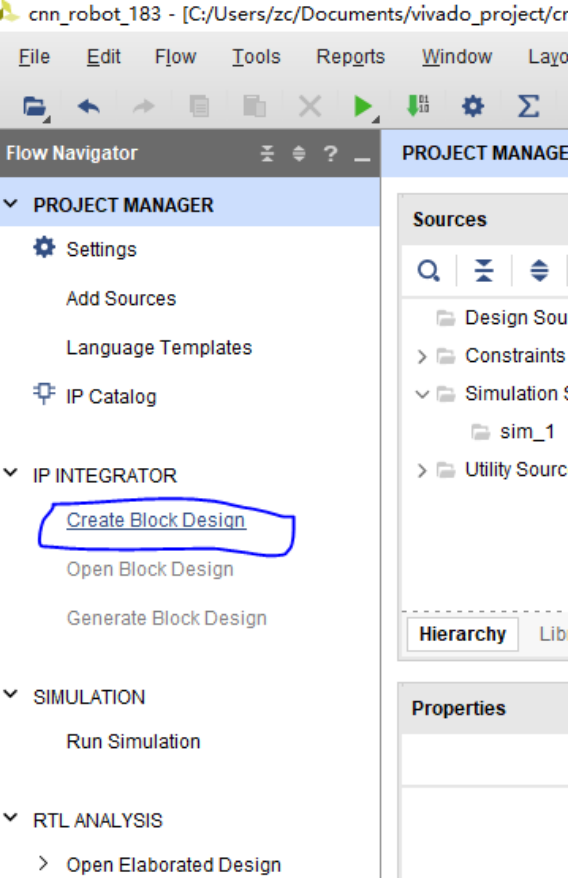

图 7

#### **3.3.8**


在 Diagram 中点击“+”添加 ZYNQ、dma (AXI direct memory access) 和我们在


hls 中生成的 IP，点击 Run block automation，结果类似下图（dma 形状可能和下图不


一致，接着往下做就好）。如图8所示。


36


图 8

#### **3.3.9**


双击 dma，按照下图配置。如图9所示。


图 9

#### **3.3.10**


双击 ZYNQ，按照下图配置。如图10所示。


37


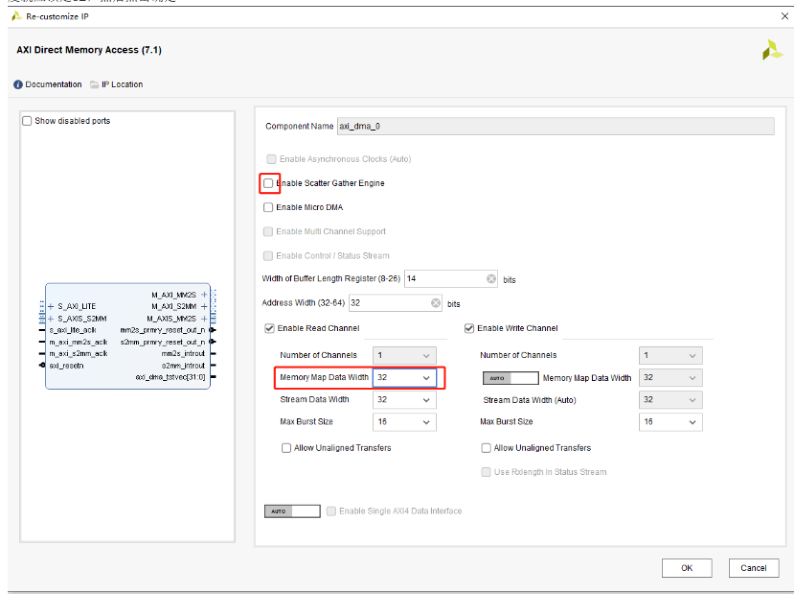
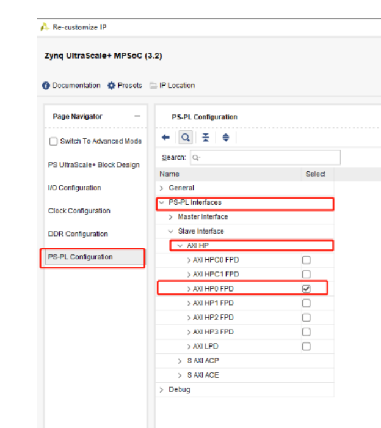
#### **3.3.11**

此时结果类似下图。如图11所示。


图 10


图 11


38


#### **3.3.12**

按照下图手动连线。如图12所示。

#### **3.3.13**


图 12


然后点击 Run connection Automation，需要点击多次，直到不能再自动连为止，最


后连线结果如下。如图13所示。


图 13


**数据流概述**


39


 - ZYNQ PS（Processing System）：


**–** ZYNQ 的 ARM 处理器（PS 部分，通过 python 编程）负责控制整个系统的运


行。


**–** PS 通过 AXI 总线与 FPGA 逻辑（PL 部分）通信。


**–** PS 负责初始化 DMA 和神经网络 IP 核，并配置数据传输。


 - DMA（Direct Memory Access）：


**–** DMA 用于在 PS 的 DDR 内存和 PL 部分的神经网络 IP 核之间高效传输数据。


**–** DMA 可以减轻 PS 的负担，直接搬运数据，而不需要 CPU 参与。


 - 神经网络 IP 核：


**–** 神经网络 IP 核是 FPGA 逻辑中实现神经网络前向计算的模块。


**–** 它从 DMA 接收输入数据（本实验为图像），进行计算，并将结果通过 DMA 写


回 DDR 内存。


**数据流图**


ZYNQ PS (ARM)


|


| (AXI-Lite) 配置和控制


|


DMA (AXI-Stream/AXI-MM)


|


| (AXI-Stream) 输入数据


|


神经网络 IP 核


|


| (AXI-Stream) 输出数据


|


DMA (AXI-Stream/AXI-MM)


|


| (AXI-MM) 写回 DDR


|


ZYNQ PS (ARM) 读取结果

#### **3.3.14**


点击 create HDL wrapper。如图14a所示。


40


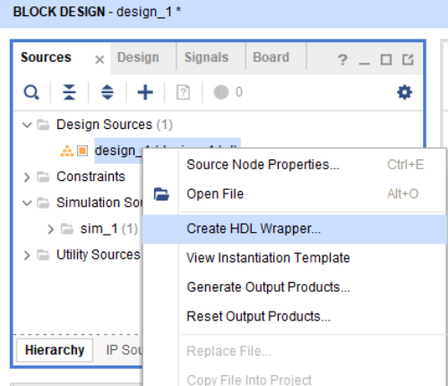

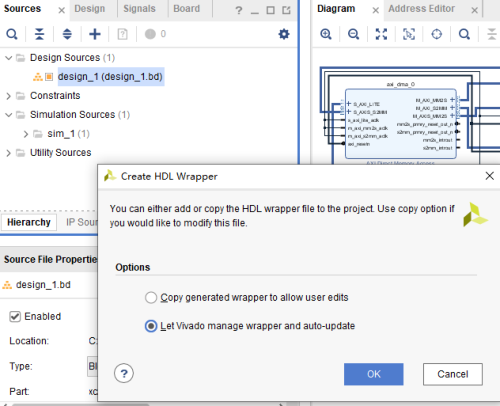

(a) (b)


图 14

#### **3.3.15**


忽略 OCM 相关的 critical warning。如图15所示。


图 15


41


#### **3.3.16**

生成比特流，这一步耗时稍长，可能在 20 分钟左右。如图16所示。


图 16

### **3.4 在线调试**


将两个文件传入 PYNQ，放在同一个目录下，除后缀外统一文件名，就组成了一个


overlay：


 - `Vivado_project/project_name/project_name.runs/impl_1/design_1_`

```
  wrapper.bit

```

 - `Vivado_project/project_name/project_name.srcs/sources_1/bd/design_1/`

```
  hw_handoff/design_1.hwh

```

然后参考 exp_PL.ipynb 即可实现在线识别

### **3.5 现实识别**


示例数据集的图片是非常理想的，只是为了介绍整个流程，不适用于现实情况，因


此同学们需要拍摄现实照片作为数据集，训练神经网络。怎么在现实拍摄的照片中取出


42


屏幕那部分，方法有很多。考虑屏幕是一个黑框这样的特点，可以结合图像处理算法提


取图片；也可以思考能否利用屏幕这个物体具有的另外一些信息，不依赖图像处理就能


把屏幕标出来。此外，针对现实的光照、角度、运动等非理想情况，系统的鲁棒性也是


一个可以提高的方向。


43


# Experiment 5: Hardware Practice of Neural Network Accelerator

## **1 Experiment Objectives**

1. Train a classification network for 6 types of flowers and accelerate it using FPGA.


2. Use FPGA acceleration to classify 12 types of flower images on the screen.

## **2 Assessment Requirements**


￿Assessment 1￿Able to perform 6-class CNN computation on FPGA, testing accuracy with


images stored internally. A score of full marks is awarded if the accuracy is above 50%.


(60%)


￿Assessment 2￿The robot is positioned at a certain distance in front of the screen, in non

ideal conditions with an angle to the screen (ensuring that both the screen and the tag are


within view). It must identify the types of flowers on the screen, allowing for movements


and turning, with a 60-second time limit. A score of full marks is awarded if the accuracy


is above 50%. (40%)

## **3 Experiment Guide**

### **3.1 Installation and Configuration**


1. Install the Python environment independently, requiring torch and torchvision. It is


recommended to use conda for management.


2. Vivado Software


(a) Download link: [https://cloud.tsinghua.edu.cn/d/24f8936484ec4be59108/](https://cloud.tsinghua.edu.cn/d/24f8936484ec4be59108/)


(b) During the installation of Vivado 18.3, select the HL Design Edition, and use


default values for other options.


31


(c) When the License interface pops up, select ”Load License,” then click ”Copy


License,” and load the vivado_license.lic file.


(d) Install the y2k22_patch-1.2 patch. The README in the folder provides in

structions for installing the patch for different Vivado versions. Follow the


instructions. Alternatively, you can manually install it by moving the au

tomg_xxxxx.tcl file from the patch folder to `<install_location>\Vivado\`


`2018.3\common\scripts`, without altering any files in Vivado.


(e) Place the ultra96v2 directory in the following path: `<install_location>`


`\Vivado\2018.3\data\boards\board_files` (For more details, you can read


this link: [https://github.com/Avnet/bdf)](https://github.com/Avnet/bdf)

### **3.2 Network Training**


1. Run cnn_robot.py by executing python cnn_robot.py in the directory where


cnn_robot.py is located. The first run may prompt errors related to model_param,


dataset, etc. Create the corresponding folders and adjust the paths as needed. This


file is used to train a two-layer CNN with a given structure based on an existing


dataset. You can modify the network structure to achieve satisfactory results. If you


modify the network structure, you also need to modify the corresponding C++ file.


2. Run write_param.py to write the trained network parameters into the network.h file


and save a test sample into picture.h. These header files will be used in Vivado HLS.

### **3.3 Generating Bitstream**

#### **3.3.1**


Open Vivado HLS, create a new project, and add the following files: network.h (net

work parameters), picture.h (a test image), and cnn_robot.cpp, which implements the


forward computation of the network in cnn_robot.py using C++. HLS will generate an


IP core based on this code, which is the main part of the FPGA design. The Top Function


is test in cnn_robot.cpp. Add tb_cnn_robot.cpp as the Testbench. Select the part as


shown in the figure below, which is the PL part of U96. See Figure 1.


32


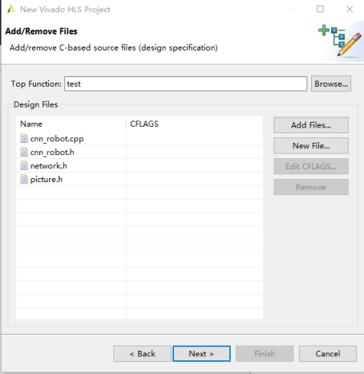


(a) (b)


Figure 1


Note: First, gather all the C++ files into the same directory and then add them in


HLS. If these files are not in the same directory, errors may occur.

#### **3.3.2**


After loading all the files, click ”Run C Simulation” to execute the test in


tb_cnn_robot.cpp. After the test completes, a log file will automatically pop up, showing


the Linear layer computation results of the CNN. Compare these results with the Linear


layer output from write_param.py to confirm accuracy before proceeding. See Figure 2.


Figure 2


33


#### **3.3.3**

Click ”Run C Synthesis” to start synthesis. This step generates Verilog code from the


C++ code. See Figure 3.


Figure 3

#### **3.3.4**


Click ”Export RTL” to package the existing project into an IP. See Figure 4.


Figure 4

#### **3.3.5**


Open Vivado, create a new project, and select the board as shown below. See Figure


5.


34


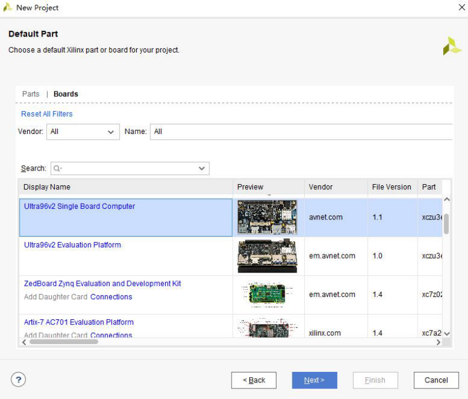

Figure 5

#### **3.3.6**


Click on settings, and add the path of the Vivado HLS project to the IP repository to


import the CNN forward computation IP we generated. See Figure 6.


Figure 6

#### **3.3.7**


Click ”Create Block Design.” See Figure 7.


35


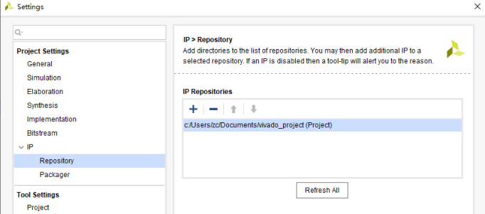


Figure 7

#### **3.3.8**


In the Diagram, click ”+” to add ZYNQ, DMA (AXI Direct Memory Access), and the


IP generated in HLS. Click ”Run Block Automation,” and the result should resemble the


figure below (the DMA shape may differ, but proceed). See Figure 8.


36


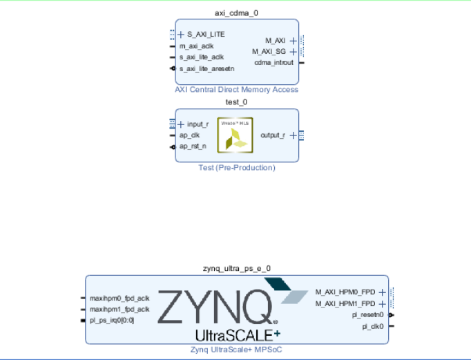

Figure 8

#### **3.3.9**


Double-click DMA and configure it as shown below. See Figure 9.


Figure 9

#### **3.3.10**


Double-click ZYNQ and configure it as shown below. See Figure 10.


37


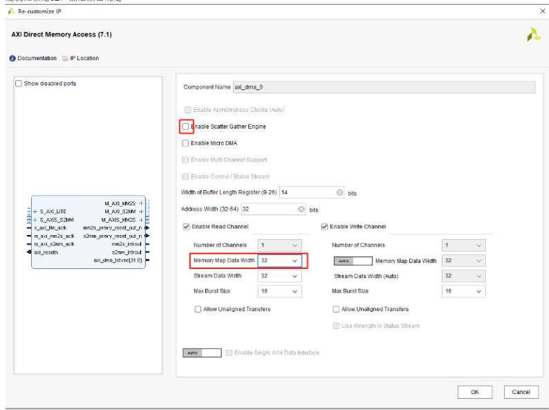


Figure 10

#### **3.3.11**


The result should resemble the figure below. See Figure 11.


Figure 11

#### **3.3.12**


Manually connect the wires as shown below. See Figure 12.


38


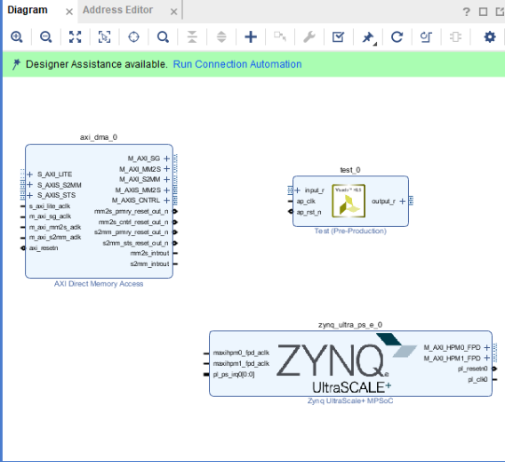
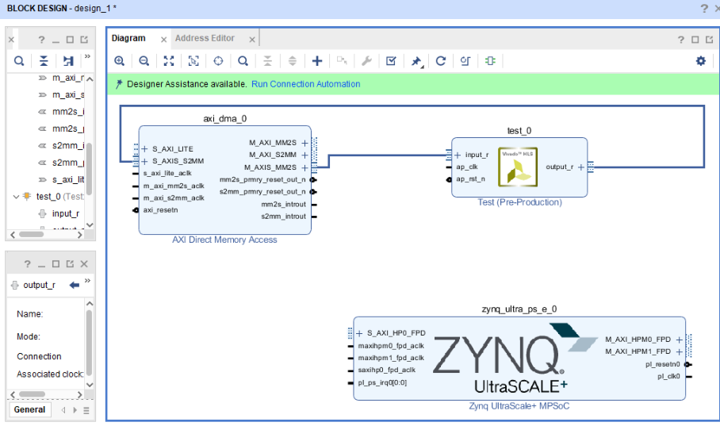

Figure 12

#### **3.3.13**


Then click ”Run Connection Automation.” Click multiple times until no more auto

matic connections can be made. The final wiring result is as follows. See Figure 13.


Figure 13


**Data** **Flow** **Overview**


 - ZYNQ PS (Processing System):


**–** The ARM processor in ZYNQ (PS part, programmed in Python) controls the


entire system.


39


**–** PS communicates with the FPGA logic (PL part) through the AXI bus.


**–** PS initializes DMA and the neural network IP core and configures data transfer.


 - DMA (Direct Memory Access):


**–** DMA is used to efficiently transfer data between the DDR memory in PS and


the neural network IP core in PL.


**–** DMA reduces the burden on PS by directly moving data without CPU involve

ment.


 - Neural Network IP Core:


**–** The neural network IP core is a module in the FPGA logic that implements the


forward computation of the neural network.


**–** It receives input data (images in this experiment) from DMA, performs compu

tations, and writes the results back to DDR memory via DMA.


**Data** **Flow** **Diagram**

ZYNQ PS (ARM)


|


(AXI-Lite) Configuration and Control


|


DMA (AXI-Stream/AXI-MM)


|


(AXI-Stream) Input Data


|


Neural Network IP Core


|


(AXI-Stream) Output Data


|


DMA (AXI-Stream/AXI-MM)


|


(AXI-MM) Write Back to DDR


|


ZYNQ PS (ARM) Reads Results

#### **3.3.14**


Click ”Create HDL Wrapper.” See Figure 14a.


40


(a) (b)


Figure 14

#### **3.3.15**


Ignore OCM-related critical warnings. See Figure 15.


Figure 15


41


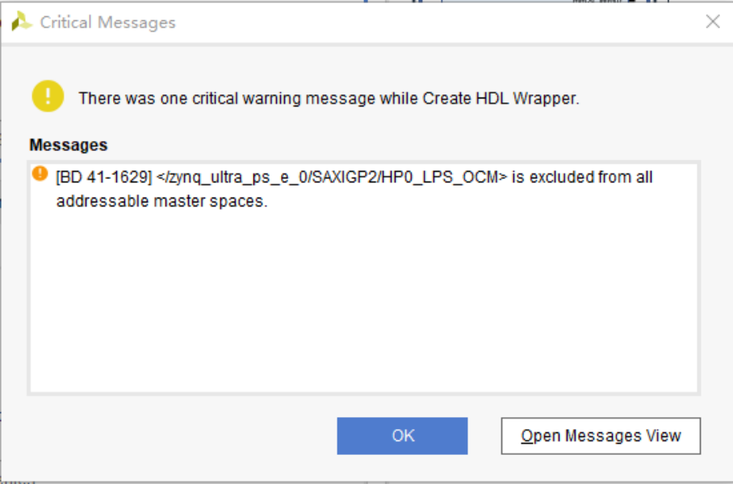
#### **3.3.16**

Generate the bitstream. This step may take around 20 minutes. See Figure 16.


Figure 16

### **3.4 Online Debugging**


Transfer two files to PYNQ, place them in the same directory, and unify the filenames


(excluding extensions) to form an overlay:


 - `Vivado_project/project_name/project_name.runs/impl_1/design_1_`

```
  wrapper.bit

```

 - `Vivado_project/project_name/project_name.srcs/sources_1/bd/design_1/`

```
  hw_handoff/design_1.hwh

```

Then refer to exp_PL.ipynb to achieve online recognition.

### **3.5 Real-World Recognition**


The images in the sample dataset are ideal and are only used to introduce the entire


process. They are not applicable to real-world situations. Therefore, students need to take


42


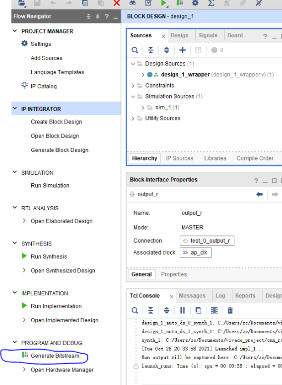
real photos as the dataset and train the neural network. There are many ways to extract


the screen portion from photos taken in real life. Considering that the screen is typically


framed in black, image processing algorithms can be used to extract it. Additionally,


one could think about leveraging other features of the screen that do not rely on image


processing to identify the screen. Moreover, in response to real-world challenges such as


lighting, angles, and motion, the system’s robustness is also an area that can be improved.


43
