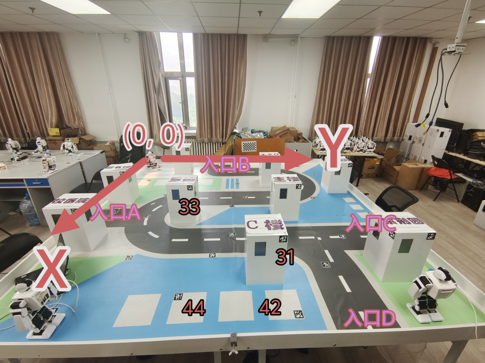

# 实验四：路径规划

## **一实验目标**

1. 初步了解简单的地图建模与路径规划。

2. 学习利用建模地图和定位点来规划机器人的路线。

3. 能综合应用前面实验中的 AprilTag 识别、相机标定、定位、机器人动作控制等功能，在实战中从起始点出发进行路径规划到达目标点。

## **二考核要求**


考核时，机器人将被随机放在赛场中的某个道路入口，我们将随机给出一个较远目标点的位置，选手需要自己设计路径规划算法，使机器人从出发点自主走到目标点（该过程不可遥控）。


【基础分数】我们将机器人放置在给定的起始点（四个道路入口之一），同时给定一个相对远的目标点位置（某个障碍物的某个侧面的 Apriltag 的 ID）。机器人从起始点出发，自主走到目标点附近（允许一定范围内的偏差）。考核示例可参考网络学堂“实验四验收视频.mp4”。

【提高分数 1：速度】从出发点出发直至到达目标点的时间会被助教记录并排名，前五名可获得不同程度的加分。

【提高分数 2：鲁棒性】除了助教给定的一个考核验收起始点外，可自选额外完成从别的

起始点（另外三个道路入口）出发并完成任务。要求使用同一套代码。每多从一个起始点出发并完成任务，均可获加分，最多可叠加三次。

## **三实验指导**


实验四是一个综合性较强的实验，综合运用了前面几次实验的内容，并且在最后的project 中将会发挥出很重要的作用，还请各位同学重视。


### **3.1 地图建模**


这一部分相关信息与代码片段已经于实验三给出，此处再次诠释一下。场地是一个长宽皆为 294.1cm 的正方形，场地与 XY 坐标系示意图可参见图 1。

场地上有定位点 tag 与障碍物 tag 两种 Apriltag。

定位点 tag 共有 18 个，都贴在地面上，给出了对应的 (x,y) 坐标与 id（也即认为世界坐标系下 Z 轴方向的分量全都是 0）（给出的坐标是每个 tag 左上角顶点的坐标，在实际定位的时候需要考虑 tag 是 5*5cm 的正方形，计算出 4 个角的坐标，详见 _expand_ ()函数）。定位点 tag 用于给定位提供信息，无需参与到地图建模中去。

障碍物 tag 共有 9 组，每一组内有 4 个，表示贴在同一个白色障碍物（占地面积25*25cm）的四个竖直面上。每组的第一个对应着该组四个 tag 中位于左上角的 tag（结合代码理解），之后的三个从上往下看呈逆时针方向。同样的，每个坐标皆是某个 tag 的4 个角中左上角顶点的坐标，需要通过 _expand_ _2() 函数计算该 tag4 个角的坐标，并加入 Z 方向（39.8cm）的坐标，实现对白色障碍物上 tag 在世界坐标系中的位置存储。


以上代码已随实验三提供，参见网络学堂“load_tag_pose.py”。实验中需要各位同学将场地长宽信息与障碍物信息建模为二维的地图，地图的数据结构请大家自行选择。基于此地图可以即插即用地与常用路径规划算法进行结合。

### **3.2 其他说明**

本次实验希望同学们可以基于前面实验的内容实现机器人在世界坐标系下的定位，并根据在坐标系中的位置关系来自行实现路径规划与动作控制。因此前面几次实验的内容也至关重要，较为准确的定位与动作控制可以将问题简化为路径规划算法本身。

 - **AprilTag** **识别** ：基于实验二的内容，机器人可以较为鲁棒地识别出 AprilTag，为后续计算位置做好准备。

 - **摄像头标定与机器人定位** ：基于实验三的内容，机器人需要可以正确获得自己当前的位置与朝向。需要说明的是，机器人可以整合不同摄像头的信息（包括头部和胸部两个），并且利用好定位点的 tag 与白色障碍物上面的 tag，这两种 tag 都可以作为定位的依据。

 - **动作控制** ：理想状况是机器人在实际场景二维平面上坐标点与坐标点之间的移动能够较为准确地通过动作函数来实现。重点参考“实验一-实验指导-如何使用机器人进行拍照和做动作-做动作/设计动作”相关内容，以及其中提到的网络学堂的相关视频与文件。需要大家通过调试来了解系统提供的各个动作指令的作用、与机器人在地图上行进的关系，然后自行编排动作。一种供参考的思路是封装好各个函数，函数内编排好系统提供的动作指令。代码段 3.2是一个简单的函数样例，通过调试获得了具体参数，能够实现对不同距离的直线行走。由于用于该测试样例的机器人在长距离行进中会逐渐右偏，因此函数中手动进行小角度左转。


<u>实战中建议各位同学记好调试所用机器人的编号或特征，不同机器人存在着一定区别，可能导致调好参数的函数带来的实际效果有很大的差异。</u>

算法的鲁棒性可能会被硬件的不确定性给制约，这是业界工程上也常常面临的困境，解决办法无非进一步提高算法鲁棒性、提高硬件精度、算法与具体硬件捆绑，本次实验我们选取最简单的第三种办法即可。

```
  def go_straight(self, distance):
```

`#` 代码逻辑仅供参考，请大家自行设计并调参。

```
     if distance > 45:
```

`#` 距离较远，用走得更快的 `"fastForward03"`

```
       num = int (np.floor(dist / 45))

       print (f"run fastForward03 for {num} time(s)")

       for _ in range (num):

         for __ in range (2):

            run_action("turn001L")
```

`#` 左转小角度防止此机器人右偏

```
            wait_req()
```

`#` 别忘了每个动作后都需要 `wait_req()`

```
         run_action("fastForward03")

         wait_req()

     else :
```

`#` 距离较近，用 `"Forwalk02"`

```
       num = int (np.floor(dist / 6))

       print (f"run Forwalk02 for {num} time(s)")

       for _ in range (num):

         run_action("Forwalk02")

         wait_req()

     pass

```

Listing 1: 机器人直线行走 Python 示例代码

### **3.3 路径规划**


如果定位与动作控制都较为准确，那实际上路径规划本身并不困难，有非常多高效的算法甚至封装好的库。


常用的路径规划的算法请大家根据老师在课堂上的介绍结合网络学堂上的课件进
行实现。也可以参考以下网页。

[https://www.awerobotics.com/implementing-path-planning-algorithms-for-robots-using-](https://www.awerobotics.com/implementing-path-planning-algorithms-for-robots-using-python/)

[python/](https://www.awerobotics.com/implementing-path-planning-algorithms-for-robots-using-python/)

[https://blog.csdn.net/kanbide/article/details/136273666](https://blog.csdn.net/kanbide/article/details/136273666)

[https://github.com/AtsushiSakai/PythonRobotics](https://github.com/AtsushiSakai/PythonRobotics)

[https://blog.csdn.net/jeffliu123/article/details/129919261](https://blog.csdn.net/jeffliu123/article/details/129919261)


具体的路径规划算法没有规定，请大家自行实现，期待大家结合地图信息与机器人特性，调试出高效的代码。


必须强调的是，根据往年实验的经验，实验四在实现上繁琐的地方更多是动作控制的部分，就算对特定机器人通过不断的调试获得了较为不错的效果，但是场地内不同局部区域、机器人电量等因素仍然会给动作控制带来一定的不确定性。众多因素会带来误差，在进行长距离行进的时候，该误差可能会累积到一个无法忽视的程度，这意味着直接根据路径规划给出从起始点到目标点的路径并且让机器人一条路走到底的算法极大概率会行不通，如果没能结合当前定位做出即时的调整，机器人很可能会在途中越走越歪，最后碰壁。因此动作调用之间还需要代码方面对于 **负反馈与闭环控制** 的优化，<u>建议大家定期更新机器人当前坐标与朝向，基于当前的信息可能需要调整最开始的规划路线。一个简单的思路如下，供大家参考：</u>


1. 输入：起始点 _A_ 、终点 _Z_
2. 在最开始规划出一条路线 _L_ 0，途径 _A →_ _B_ _→_ _C_ _→_ _... →_ _Z_
3. 在途经点 _B_ 处，获得机器人当前实际坐标 _B_ _′_ 与朝向，并进行判断：
3.1. _∥B −_ _B_ _′∥_ 2 _≤_ _ϵ_ ：新路线 _L_ 1 _⊂L_ 0，且 _L_ 1 : _B_ _→_ _C_ _→_ _... →_ _Z_
3.2. _∥B −_ _B_ _′∥_ 2 _> ϵ_ ：已偏离原规划路线，重新规划新路线 _L_
4. 基于新的路线行走，并对后续途经点重复 3 的过程

<u>5.</u> <u>抵达终点</u> _<u>Z</u>_

_′_ _′_
1 <sup>，则</sup> <sup>_L_</sup> 1 <sup>:</sup> <sup>_B_</sup> _′_ _→_ _... →_ _Z_

还有一个需要提醒的地方，在机器人进行定位时，需要考虑当前摄像头的视野内可能没有可用的 AprilTag 的情形，导致无法进行定位。可以加入转头、小范围移动等执行逻辑，直到在原位置附近能正确通过 AprilTag 实现定位。

将硬件方面的动作控制与算法方面的路径规划进行结合，这是实验四最为考验的地方，既是机器人繁琐之处，也是其魅力所在。祝同学们顺利！


图 1: 场地、定位点、白色障碍物、XY 坐标系示意图   ·


